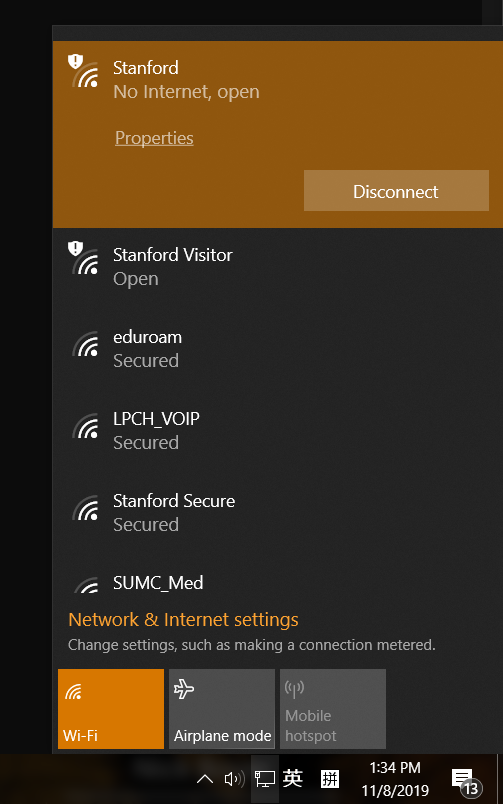
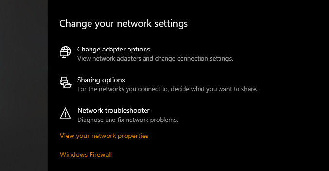
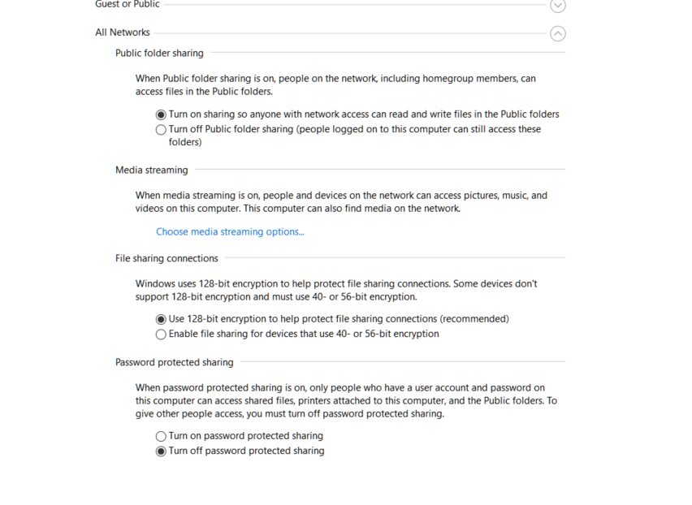
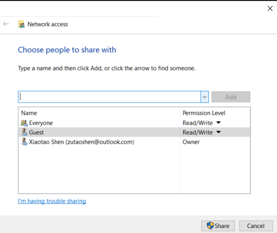
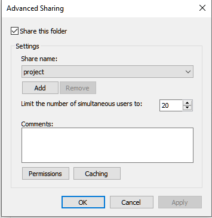
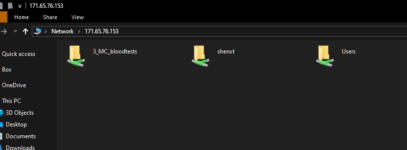

# 如何在两台电脑间共享文件夹?

参考帖子:

https://jingyan.baidu.com/article/93f9803f3e9788e0e46f55c8.html

1. 保证两台电脑在同一个网络中.对于Stanford来说,如果在其他地方,需要连接VPN.

2. 在workstation(电脑B)上打开网络设置.



3. 选择`Sharing options`



4. `Private`按照下面进行设置.


5. `All network按照下面设置`



6. 选择要共享的文件夹,然后右键打开属性.然后选择`Share`.


7. 选择`Everyone`,然后点击`Share`.



8.然后再点击第6步中的`Advanced Sharing`.按照下图设置.



9.快捷键`win + R`打开`run`.然后输入B电脑的IPV4地址.然后需要登录,注意,使用的是你在B电脑上的账号和密码登录,有时候注意登录名前需要添加`win\`


10. 最终效果如下图.



# CMD命令

## 如何使用CMD修改路径?

如果修改某个盘,先直接打盘名加冒号即可,不需要使用`cd`命令.

```
D:
```

然后进入到某个盘的子目录下,才需要使用`cd`命令.

## 查看当前路径

```
cd
```

## 查看当前路径下文件

```
dir
```