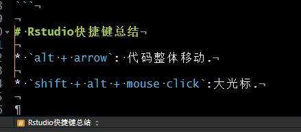

# R一些常用小命令

## 系统相关

### 重启R session

```
.rs.restartR()
```

# Rstudio快捷键总结

* `alt + arrow`: 代码整体移动.

* `shift + alt + mouse click`:大光标.




# R小技巧

## 从字符串获取其所代表的变量名的对象

使用`get()`函数.比如:

```{r}
a <- 1:10
b <- "a"
b
get(b)
```

## 将某个对象赋予某个字符串所代表的变量名

使用`assign()`函数.

```{r}
b <- "a"
assign(x = b, value = 1:10)
a
b
```

这个函数非常有用,尤其是在一个循环中,你想将每个循环获得的对象赋予给一些使用数字编号的变量名中.

```{r}
rm(list = ls())
for(i in 1:10){
  cat(i, " ")
  temp <- 1:i
  assign(x = paste("run", i, sep = "_"), value = temp)
}

run_1
run_5
run_10
```

