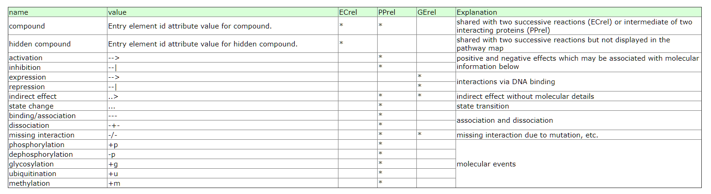

# KEGG Pathway数据库

KEGG pathway的数据是使用`KGML`(KEGG Markup Language)格式存储下来的.详细的信息可以阅读官方文档.

https://www.kegg.jp/kegg/xml/docs/

## 背景

KEGG pathway有两个类型.

* **reference pathways**: 手动画的.

* **organism-specific pathways**: 使用计算方法自动从reference pathway得到的.

在`KGML`文件中,`entry`指的是node,而`relation`和`reaction`指的是整个网络的边.在KEGG pathway中,矩形表示基因(也可以认为是gene的产物蛋白质),而circle代表的是metabolite.

如果网络中只有`entry`和`relation`,则该网络称为`protein network`.如果只有`entry`和`reaction`,则称为`chemical network`.

所以一般来说,可以用两种方式来表示metabolic pathway:

1. metabolic pathways viewed as both protein networks and chemical networks and

2. regulatory pathways viewed as protein networks only.

## `KGML`的overview


这幅图是整个`KGML`的总览.

## 如何获得某个pathway`KGML`文件

使用R包`KEGGlincs`可以下载pathway的`KGML`文件.

```{r, message=FALSE, warning=FALSE}
library(tidyverse)
library(KEGGREST)
library(KEGGlincs)
###
#获得所有has的pathway ID
path_id <- KEGGREST::keggList(database = "pathway", 
                              organism = "hsa")
head(path_id)
path_id <- 
  path_id %>% 
  names() %>% 
  unique() %>% 
  stringr::str_replace("path:", "")
head(path_id)

##下载kgml文件并进行解析
temp_kgml <- 
  KEGGlincs::get_KGML(pathwayid = path_id[1])
class(temp_kgml)
temp_kgml
```

`get_KGML()`函数其实分别使用了`KEGGREST`包中的`keggGet()`函数来下载的,然后使用`KEGGgraph`包中的`paraseKGML()`函数来解析.

```{r}
temp_kgml2 <-
  KEGGREST::keggGet(dbentries = path_id[1], option = "kgml")
class(temp_kgml2)

temp_kgml2 <- 
  KEGGgraph::parseKGML(file = temp_kgml2)
temp_kgml2
```

## Pathway

### Pathway element

一共有六个属性.

```{r,echo=FALSE}
kableExtra::kable(x = 
                  data.frame(
                    Attribute.name = c("name", "org", "number", "title", "image", "link"),
                    Explanation = c("Pathway ID", "ko/ec/org ID","pathway ID numebr",
                                    "pathway title",
                                    "pathway figure link",
                                    "pathway link"),
                    stringsAsFactors = FALSE
                  )
                  )

```

我们可以下载pathway的图片.

```{r}
image_link <- slot(slot(temp_kgml, "pathwayInfo"), "image")
image_link
download.file(url = image_link, 
              destfile = basename(image_link), 
              mode = "wb")
```


## Entry(条目)

### Entry element

包括了网络中的node的属性.属性包括以下内容.

```{r,echo=FALSE}
kableExtra::kable(x = 
                  data.frame(
                    Attribute.name = c("id", "name", "type", "link", "reaction"),
                    Explanation = c("ID of the entry",
                                    "KEGG ID of the entry",
                                    "Type of the entry",
                                    "Link of the entry",
                                    "The KEGG ID of corresponding reaction"),
                    stringsAsFactors = FALSE
                  )
                  )

```

```{r}
#整体信息
temp_kgml@pathwayInfo
#分别的属性
temp_kgml@pathwayInfo@name
temp_kgml@pathwayInfo@org
temp_kgml@pathwayInfo@number
temp_kgml@pathwayInfo@title
temp_kgml@pathwayInfo@image
temp_kgml@pathwayInfo@link
```

图片下载链接:

[](http://www.kegg.jp/kegg/pathway/hsa/hsa00010.png)

pathway详细信息链接:

[](http://www.kegg.jp/kegg-bin/show_pathway?hsa00010)

我们下面看看pathwa中node的信息.

```{r}
temp_kgml
```
可以看到这个pathway含有node,edge还有reaction.

```{r}
# node
temp_kgml@nodes$`18`
#edge
temp_kgml@edges[[1]]
#reaction
temp_kgml@reactions[[1]]
```

#### Type属性的详细解释

在pathway中,如果一个pathway链接到另外一个pathway,那么pathway也是会被作为一个node展示出来.

```{r,echo=FALSE}
kableExtra::kable(x = 
                  data.frame(
                    Attribute.name = c("ortholog", "enzyme", 
                                       "reaction", "gene", 
                                       "group", "compound",
                                       "map", "brite", "other"),
                    Explanation = c("the node is a KO (ortholog group)", "the node is an enzyme",
                                    "the node is a reaction", "the node is a gene product (mostly a protein)",
                                    "the node is a complex of gene products (mostly a protein complex)",
                                    "the node is a chemical compound (including a glycan)",
                                    "the node is a linked pathway map",
                                    "the node is a linked brite hierarchy",
                                    "	the node is an unclassified type"),
                    stringsAsFactors = FALSE
                  )
                  )

```

## Relation

### relation元素

这里面的relation不包括我们所知道的酶催化代谢物的联系.只包括两个proteins(gene products)或者两个KOs(ortholog groups)或者protein和compound


```{r,echo=FALSE}
kableExtra::kable(x = 
                  data.frame(
                    Attribute.name = c("entry1", "entry2", 
                                       "type"),
                    Explanation = c("the first (from) entry that defines this relation",
                                    "the second (to) entry that defines this relation",
                                    "the type of this relation"),
                    stringsAsFactors = FALSE
                  )
                  )

```

#### Type属性

relation的type一共有5个,分别是

* **ECrel**: enzyme-enzyme relation, indicating two enzymes catalyzing successive reaction steps.代表的是两个酶之间的联系,比如enzyme1-metabolite1-enzyme2-metabolite2.那么enzyme1-enzyme2之间的关系realtion就是`ECrel`.

* **PPrel**: protein-protein interaction, such as binding and modification.

* **GErel**: gene expression interaction, indicating relation of transcription factor and target gene product.

* **PCrel**: protein-compound interaction,注意这个关系不是enzyme催化的关系.

* **maplink**: 跟另外一个pathway的联系.

#### subtype element

每个relatio还有一个subtype属性.这个属性用来对relation做进一步的说明.

* **name**: interation/relation的信息.

包含以下几种信息.



其中`compound`是指这个relation其实是两个enzyme.

```{r}
temp_kgml@edges[[1]]@entry1ID
temp_kgml@edges[[1]]@entry2ID
temp_kgml@edges[[1]]@type
temp_kgml@edges[[1]]@subtype
```

这个relation就是两个enzyme连接起来的.

## Reaction反应

reaction和relation很类似.不一样的是type属性.

type属性包括`reversible`和`irreversible`.分别表示可逆反应和不可逆反映.

```{r}
temp_kgml@reactions[[1]]@name
temp_kgml@reactions[[1]]@type
temp_kgml@reactions[[1]]@substrateName
temp_kgml@reactions[[1]]@productName
```


