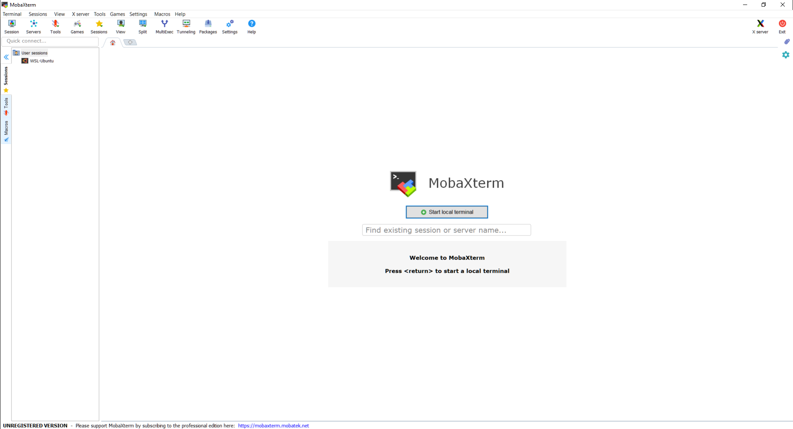

```{r setup, include=FALSE}
library(reticulate)
```

# 第一次课程 (Day 01)

收到老师邮件,如下:

> The first class of the BIOS274 mini-course is on Monday at 9:30a in room M112 (the room is entered from Alway building courtyard).    
There is software that you need to install before this first class.   
1. Anaconda (this has Python 3, jupyter, and much more)   
2. Atom and Hydrogen   
3. Karel the Robot [also available from the canvas Files > Lectures > Day1 folder]    
4. Only if you have a Windows computer, MobaXterm   
The syllabus has details on where to find these tools and how to test the install:   
https://docs.google.com/document/d/140OLR6tMPTvYwmHBREiDRIvTA1cXoXWzfVP-px9IlEs   
Be sure your laptop has a full charge, there are very few electrical outlets in M112.   

## 前期准备

### 安装`Anaconda`

这个已经安装.

### 安装`Atom`和`Hydrogen`

`Atom`我以前就安装过.

Hydrogen是一个能在Atom中模拟Jupyter编辑方式的插件,安装教程参考如下帖子:

https://blog.csdn.net/simplehouse/article/details/78348298

1. 首先安装`IJavascript`

打开`terminal`,这是微软新开发的类似于linux终端的应用.

输入下列代码:

```
npm install -g ijavascript
```

2. 安装`Jupyter`

使用pip工具安装,仍然在terminal下:

```
pip install --upgrade pip
pip install jupyter
```

3. 全局安装`IJavascript`内核

```
ijsinstall --install=global
```

4. 在`Atom`中安装`Hydrogen`

直接输入下列代码,在terminal中:

```
apm install hydrogen
```

5. 更新`Hydrogen`的内核

`IJavascript`内核安装完毕,并不意味着`Hydrogen`就能开始使用,需使用`Hydrogen: Update Kernels`命令更新内核.(通过`cmd/ctl +shift + P`打开`Atom`的`Command Palette`执行),或者重新启动一次`Atom`也可以更新其内核.

6. 使用

打开Atom,然后新建一个文件,保存位`py`文件,然后使用快捷键`ctl/cmd + Enter`可以执行`Hydrogen`.

### 下载第一天课件

地址如下:

```
D:\study\python class\karel_the_robot
```

### 安装`MobaXterm`

老师给了介绍链接:

https://docs.google.com/document/d/140OLR6tMPTvYwmHBREiDRIvTA1cXoXWzfVP-px9IlEs/edit

只有windows的电脑才需要安装该软件.

查了以下,这个其实跟`Xshell`很像,用来连接Linux的工具.

参考帖子如下:

https://blog.csdn.net/weixin_35353187/article/details/81355088

官网下载:

https://mobaxterm.mobatek.net/

下载之后,直接解压缩安装即可.

安装结束之后,打开如下:


这个软件的好处是可以模拟terminal,所以其实也可以代替微软自带的terminal.

到这里,就已经准备好了老师的课前要求.


## 课程

跟R不同,python中有不同的对象来执行命令,常见的有语句,函数(function)和方法(method).我们简单来介绍一下他们.

### 函数(function)

这是跟R最像也是一致的东西,所以比较好理解.函数是封装了多条语句用来完成特定任务的一段代码.

```
function(object, arg1, arg2,...)
```

函数执行的时候,第一个参数一般是要处理的对象.然后是其他的一些形参.

```{python}
a = [1 ,2 ,3]
sum(a)
a
str(a)
a
```

可以看到,跟R一样,对一个对象用某个R数处理之后,一般会返回处理结果,并且对原来的对象并没有做任何处理,原来的对象没有发生任何变化,如果想要得到处理之后的结果,需要将其赋值给某个对象.

```{python}
a = [1,2,3]
b = str(a)
a
b
type(a)
type(b)
```

### 方法(method)

R中好像没有方法?方法一般是对某些特殊类型的对象进行处理,比如对于字符串,就有很多可以用于字符串处理的方法.方法的调用是使用下列语法:

```
object.method(arg1, arg2,...)
```

```{python}
test = "Jasper Shen is a postdoc at Stanford University."
type(test)
test.find("S")
test.count("S")
```

方法和函数有一点最不一样的,如果实对对象进行处理,那么不需要赋值,很多时候是对对象`就地改变的`.

### 语句

语句是一段可执行的代码,常见的有赋值语句(`=`),`if`,`for`,`while`,`import`,`return`,`break`,`pass`,`with`语句等.


