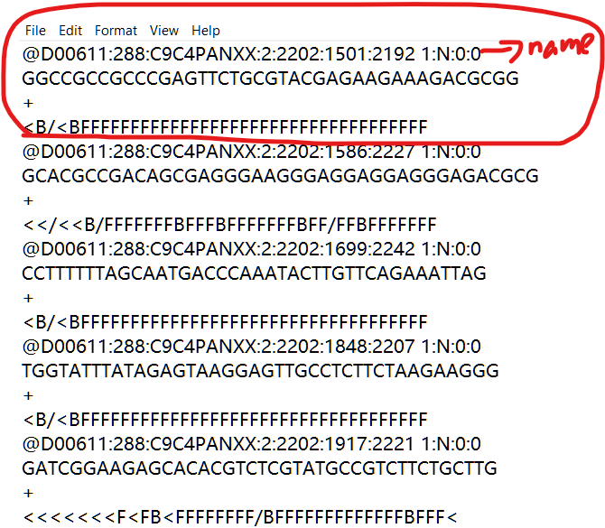

---
authors:
- admin
categories: [Python]
date: "2019-12-03T00:00:00Z"
draft: false
featured: true
image:
  caption: ""
  focal_point: ""
projects: []
subtitle: Learn how to blog in Academic using Jupyter notebooks
summary: Learn how to blog in Academic using Jupyter notebooks
tags: []
title: Python for genomics day 05
---

{}

第五天的知识点总结.

# FASTQ格式数据
                                            
Fastq是测序数据下机格式，其中包含测序序列(reads)的序列信息及其对应的测序质量信息。FASTQ格式文件中每个read由四行(name,sequence,comment,quality)描述，如下：
                                            
```
@YJM244_SRR800767.1 1 length=202      
TGTGAAACTTAGTTTTCTTTTTGTATTGGGGTGTAATTTCTTATTTTCCCTGTATTTCACCGCATGCAA      
+YJM244 : Geographic Location of Isolate: Romania, Source: Clinical      
CC@FDDFFHHHHHJJJJJJIIIJFHJGJJJJ:DCDDGHIJJG4DGIDGH<9??9=F@))B8-''557=A)? 
```

最开始,桑格研究所的FASTQ格式允许序列与质量信息分成多行进行保存,但是一般不推荐采用这种方式,因为第一和第三行开头的@与+符号同样也可能出现在质量信息中,可能会造成信息提取的困难.

## name

其中第一行是该read的name,以“@”开头，随后为Illumina 测序标识符(Sequence Identifiers)和描述文字(选择性部分).不同的公司或者软件不太一样.他是每一条read的唯一标识符,同一份FASTQ文件中不会出现重复,甚至不同的FASTQ的文件中也不会出现重复.

以下面的为例:

```
@HWUSI-EAS100R:6:73:941:1973#0/1
```


Identifier   | Meaning
--------------|--------------------------
HWUSI-EAS100R | the unique instrument name
6 | flowcell lane
73 | tile number within the flowcell lane
941 | 'x'-coordinate of the cluster within the tile
1973 | 'y'-coordinate of the cluster within the tile
#0 | index number for a multiplexed sample (0 for no indexing)
/1| the member of a pair, /1 or /2 (paired-end or mate-pair reads only)


## Sequence

第二行是碱基序列.由A,C,T,C.N五个字母组成,这也是我们真正关心的DNA序列,NA代表的是那些无法被识别出来的碱基.

## Comment

第三行以“+”开头，在旧版的FASTQ文件中,会直接赋值第一行的信息,但是现在一般什么都不加,用以节省存储空间.  

## Quality

第四行是对应序列的测序质量。是和第二行的sequence一一对应的,所以第四行和第二行的长度必须相等.第四行中每个字符对应的ASCII值减去33，即为第二行对应碱基质量。用来描述每个测序碱基的可靠程度,用ASCII码表示.

FASTQ格式中质量值具有重要的作用，在很多的分析中会用到这个质量值，例如数据质控，数据过滤，序列拼接，短序列比对，变异检测中都要用到这个质量值。
这个质量值是基于phred质量值体系.

但是由于单个碱基无法与两位的质量值相匹配，例如A碱基对应的质量值为40，一个A字符对应两个字符40，因此需要将原始质量值加上33或者64，在转换为对应的ASCII码值，为何加33，因为33以下ASCII码无法用键盘字符表示出来。illumina测序1.8版本以上加33，以下加64。

质量评分(quality score,Q-score)是一个碱基的错误概率的对数值。由phred程序的开发者定义,一般可以称之为phred quality,

如果测序错误率用e表示，Illumina测序平台的碱基质量值用Qphred表示，则有下列关系：

$ASCII - 33 = Qphred　=　-10log10(e)$

此公式可说明，quality score越大测序错误率(e)越低，准确性越高.

A quality score (or Q-score) expresses an error probability. In particular, it serves as a convenient and compact way to communicate very small error probabilities.

Given an assertion, A, the quality score, Q(A), expresses the probability that A is not true, P(~A), according to the relationship:

 Q(A) =-10 log10(P(~A))

where P(~A) is the estimated probability of an assertion A being wrong.

https://support.illumina.com/help/BaseSpace_OLH_009008/Content/Source/Informatics/BS/QualityScores_swBS.htm

碱基的quality score是怎么来的呢?

Phred最初是一个从测序仪中产生的荧光记录数据中识别碱基的程序。在早期的荧光染料测序中，每次发生碱基合成时会释放出荧光信号，该信号被CCD图像传感器捕获。记录下荧光信号的峰值，生成一个实时的轨迹数据（chromatogram）。因为不同的碱基用不用的颜色标记，检测这些峰值即可判断出对应的碱基。但由于这些信号的波峰、密度、形状和位置等是不连续或模糊的，有时很难根据波峰判断出正确的碱基。

Phred计算许多与波峰大小和分辨率相关的参数，根据这些参数，从一个巨大的查询表中找出碱基质量得分。这个查询表是根据对已知序列的测序数据分析得到的（应该是分析得到波峰参数与碱基错误率的关系，再通过公式把错误率转换成质量得分，得到波峰参数与质量得分的直接对应表）。不同的测序试剂和机器用不同的查询表。为了节约磁盘空间，质量得分（可能占用两个字符）按一定规则（Phred+33或Phred+64）被转换为单个字符表示。

碱基错误率和质量得分的关系由如下两种:

$Qphred = -10*log10(p)$


$Qillumina-prior to v.1.4 = -10log10(p/(1-p))$


# 读取FASTQ数据

首先定义读取FASTQ数据的函数.


```python
def seq_list_from_fastq_file(filename):
'''
this function only get the sequence and quality informaton
'''
    seq_list = []
    quality_list = []
    
    with open(filename) as FASTQ_INPUT:
        line_cnt = 0
        for line in FASTQ_INPUT:
            line_cnt += 1
            if line_cnt == 2:
                seq_list.append(line.strip())
            if line_cnt % 4 == 0:
                quality_list.append(line.strip())
                line_cnt = 0

    return seq_list, quality_list
```

读取一个实例数据
下图是该数据的截图.可以看到comment除了`+`意外,没有任何内容.




```python
# FASTQ from ChIP-seq experiment ENCSR784FYS
# file accession ENCFF733YBM
fastq_filename = 'ENCFF733YBM-trunc.fastq'
sequence, quality = seq_list_from_fastq_file(fastq_filename)
```

将读取到的sequence和quality信息打印出来.


```python
# string at index 0 of list
print('Length of sequence list = ', len(sequence), ',\tFirst sequence = \'', \
      sequence[0], '\'', sep='')
print('Length of quality list  = ', len(quality),  ',\tFirst quality  = \'', \
      quality[0], '\'', sep='')
```

    Length of sequence list = 100,	First sequence = 'GGCCGCCGCCCGAGTTCTGCGTACGAGAAGAAAGACGCGG'
    Length of quality list  = 100,	First quality  = '<B/<BFFFFFFFFFFFFFFFFFFFFFFFFFFFFFFFFFFF'
    

可以看到该文件一共有100条read信息.根据对碱基质量的定义,我们可以把第一个read的每个碱基的quality score打印出来.


```python
# take apart quality value encoding
for x in range(len(sequence[0])):
    print('{}\t{}\t{}\t{}\t{}'.format(sequence[0][x], 
                                              quality[0][x],
                                              ord(quality[0][x]) - 33,
                                              (ord(quality[0][x]) - 33) * -0.1,
                                              pow(10, (ord(quality[0][x]) - 33) * -0.1 )))
```

    G	<	27	-2.7	0.001995262314968879
    G	B	33	-3.3000000000000003	0.000501187233627272
    C	/	14	-1.4000000000000001	0.03981071705534971
    C	<	27	-2.7	0.001995262314968879
    G	B	33	-3.3000000000000003	0.000501187233627272
    C	F	37	-3.7	0.00019952623149688788
    C	F	37	-3.7	0.00019952623149688788
    G	F	37	-3.7	0.00019952623149688788
    C	F	37	-3.7	0.00019952623149688788
    C	F	37	-3.7	0.00019952623149688788
    C	F	37	-3.7	0.00019952623149688788
    G	F	37	-3.7	0.00019952623149688788
    A	F	37	-3.7	0.00019952623149688788
    G	F	37	-3.7	0.00019952623149688788
    T	F	37	-3.7	0.00019952623149688788
    T	F	37	-3.7	0.00019952623149688788
    C	F	37	-3.7	0.00019952623149688788
    T	F	37	-3.7	0.00019952623149688788
    G	F	37	-3.7	0.00019952623149688788
    C	F	37	-3.7	0.00019952623149688788
    G	F	37	-3.7	0.00019952623149688788
    T	F	37	-3.7	0.00019952623149688788
    A	F	37	-3.7	0.00019952623149688788
    C	F	37	-3.7	0.00019952623149688788
    G	F	37	-3.7	0.00019952623149688788
    A	F	37	-3.7	0.00019952623149688788
    G	F	37	-3.7	0.00019952623149688788
    A	F	37	-3.7	0.00019952623149688788
    A	F	37	-3.7	0.00019952623149688788
    G	F	37	-3.7	0.00019952623149688788
    A	F	37	-3.7	0.00019952623149688788
    A	F	37	-3.7	0.00019952623149688788
    A	F	37	-3.7	0.00019952623149688788
    G	F	37	-3.7	0.00019952623149688788
    A	F	37	-3.7	0.00019952623149688788
    C	F	37	-3.7	0.00019952623149688788
    G	F	37	-3.7	0.00019952623149688788
    C	F	37	-3.7	0.00019952623149688788
    G	F	37	-3.7	0.00019952623149688788
    G	F	37	-3.7	0.00019952623149688788
    

再看一下quality score的计算办法.

每个碱基的quality score都是使用一个ASCII字符来表示的.
比如第一个read的质量:


```python
quality[0]
quality[0][0]
```


    '<'


```python
ord(quality[0][0])
```


    60


第一个碱基的quality score的字符是`<`,ord函数是用来返回一个字符的unicode code.所以对于某个碱基,他的quality score就是`ord(quality) - 33`.


```python
help(ord)
```

    Help on built-in function ord in module builtins:
    
    ord(c, /)
        Return the Unicode code point for a one-character string.
    
    


```python
print(sequence[0][0])#碱基
print(quality[0][0])#碱基质量字符
print(ord(quality[0][0]) - 33)#碱基quality score
```

    G
    <
    60
    27
    

下面我们用quality score这个碱基错误的概率值.


```python
qs = ord(quality[0][0]) - 33
print(qs)
print(qs * -0.1)
pow(10, (qs * -0.1 ))
```

    27
    -2.7
    


    0.001995262314968879


```python
help(pow)
```

    Help on built-in function pow in module builtins:
    
    pow(x, y, z=None, /)
        Equivalent to x**y (with two arguments) or x**y % z (with three arguments)
        
        Some types, such as ints, are able to use a more efficient algorithm when
        invoked using the three argument form.
    
    

可以看到该碱基错误的概率为0.001995.也就是说,错误概率越小,quality score越大.


```python
# a little easier to view with just the unique characters
quality_set = set(list(quality[0]))
print(quality_set)
# add float and scientific notation to output of probability
print('char\tASCII\tqual\texponent\tprob')
for x in quality_set:
    print('{}\t{}\t{}\t{:f}\t{:e}'.format(x,
                                        ord(x),
                                        ord(x) - 33,
                                        (ord(x) - 33) * -0.1,
                                        pow(10, (ord(x) - 33) * -0.1 )))
```

    {'/', 'B', '<', 'F'}
    char	ASCII	qual	exponent	prob
    /	47	14	-1.400000	3.981072e-02
    B	66	33	-3.300000	5.011872e-04
    <	60	27	-2.700000	1.995262e-03
    F	70	37	-3.700000	1.995262e-04
    

上面这段代码展示了几种在第一个read中,几种quality的字符所代表的ASCII code,以及错误率.

完整的ASCII tabe可以看这里.
https://www.cs.cmu.edu/~pattis/15-1XX/common/handouts/ascii.html

我们在计算一个,如果知道错误率,那么得到的字符应该是什么.


```python
# more exploring
import math as math
quality_prob = 1.995262e-04
print('math.log():\t\t',                   math.log(quality_prob, 10) * -10)
print('int(math.log()):\t',            int(math.log(quality_prob, 10) * -10))
print('chr(int(math.log())):\t\'', chr(int(math.log(quality_prob, 10) * -10)), '\'', sep='')
```

    math.log():		 37.000000685570285
    int(math.log()):	 37
    chr(int(math.log())):	'%'
    


```python
print('chr(int(math.log()) + 33):\t\'', chr(int(math.log(quality_prob, 10) * -10) + 33), '\'', sep='')
```

    chr(int(math.log()) + 33):	'F'
    

# 另一种读取FASTQ数据的方法


```python
ks = ['name', 'sequence', 'optional', 'quality']

def process_lines(lines):
    '''
    process a group of 4 lines from fastq file
    dividing them into dictionary, with a key for each category
    '''
    record = {}

    for x in range(len(lines)):
        record[ks[x]] = lines[x]

    return record
```

首先定义一个读取每个read的函数.


```python
fastq_dictionary = {}

with open(fastq_filename) as FASTQ_INPUT:
    line_cnt = 0
    lines = []
    output_lines = 0
    for line in FASTQ_INPUT:
        line_cnt += 1
        lines.append(line.rstrip())
        if line_cnt % 4 == 0:
            record_dict = process_lines(lines)
            line_cnt = 0
            lines = []
            output_lines += 1
            if output_lines < 7:
                print(record_dict)
            fastq_dictionary[record_dict['name']] = record_dict
```

    {'name': '@D00611:288:C9C4PANXX:2:2202:1501:2192 1:N:0:0', 'sequence': 'GGCCGCCGCCCGAGTTCTGCGTACGAGAAGAAAGACGCGG', 'optional': '+', 'quality': '<B/<BFFFFFFFFFFFFFFFFFFFFFFFFFFFFFFFFFFF'}
    {'name': '@D00611:288:C9C4PANXX:2:2202:1586:2227 1:N:0:0', 'sequence': 'GCACGCCGACAGCGAGGGAAGGGAGGAGGAGGGAGACGCG', 'optional': '+', 'quality': '<</<<B/FFFFFFFBFFFBFFFFFFFBFF/FFBFFFFFFF'}
    {'name': '@D00611:288:C9C4PANXX:2:2202:1699:2242 1:N:0:0', 'sequence': 'CCTTTTTTAGCAATGACCCAAATACTTGTTCAGAAATTAG', 'optional': '+', 'quality': '<B/<BFFFFFFFFFFFFFFFFFFFFFFFFFFFFFFFFFFF'}
    {'name': '@D00611:288:C9C4PANXX:2:2202:1848:2207 1:N:0:0', 'sequence': 'TGGTATTTATAGAGTAAGGAGTTGCCTCTTCTAAGAAGGG', 'optional': '+', 'quality': '<B/<BFFFFFFFFFFFFFFFFFFFFFFFFFFFFFFFFFFF'}
    {'name': '@D00611:288:C9C4PANXX:2:2202:1917:2221 1:N:0:0', 'sequence': 'GATCGGAAGAGCACACGTCTCGTATGCCGTCTTCTGCTTG', 'optional': '+', 'quality': '<<<<<<<F<FB<FFFFFFFF/BFFFFFFFFFFFFFBFFF<'}
    {'name': '@D00611:288:C9C4PANXX:2:2202:1953:2230 1:N:0:0', 'sequence': 'CTTTCTCCTGTCTCAGGTGACCAAGAATATGGCCCAGGTG', 'optional': '+', 'quality': '<</<<FBFFFFFFBFFFFFFFFFFFFFFFFFF<FFFFFFF'}
    


```python
print(len(fastq_dictionary))
print(fastq_dictionary.keys())
fastq_dictionary[list(fastq_dictionary.keys())[0]]
```

    100
    dict_keys(['@D00611:288:C9C4PANXX:2:2202:1501:2192 1:N:0:0', '@D00611:288:C9C4PANXX:2:2202:1586:2227 1:N:0:0', '@D00611:288:C9C4PANXX:2:2202:1699:2242 1:N:0:0', '@D00611:288:C9C4PANXX:2:2202:1848:2207 1:N:0:0', '@D00611:288:C9C4PANXX:2:2202:1917:2221 1:N:0:0', '@D00611:288:C9C4PANXX:2:2202:1953:2230 1:N:0:0', '@D00611:288:C9C4PANXX:2:2202:1787:2250 1:N:0:0', '@D00611:288:C9C4PANXX:2:2202:2095:2230 1:N:0:0', '@D00611:288:C9C4PANXX:2:2202:2296:2185 1:Y:0:0', '@D00611:288:C9C4PANXX:2:2202:2372:2192 1:N:0:0', '@D00611:288:C9C4PANXX:2:2202:3089:2192 1:N:0:0', '@D00611:288:C9C4PANXX:2:2202:3235:2205 1:N:0:0', '@D00611:288:C9C4PANXX:2:2202:3006:2209 1:N:0:0', '@D00611:288:C9C4PANXX:2:2202:3276:2220 1:N:0:0', '@D00611:288:C9C4PANXX:2:2202:3530:2181 1:Y:0:0', '@D00611:288:C9C4PANXX:2:2202:3628:2193 1:N:0:0', '@D00611:288:C9C4PANXX:2:2202:3614:2206 1:N:0:0', '@D00611:288:C9C4PANXX:2:2202:4033:2192 1:N:0:0', '@D00611:288:C9C4PANXX:2:2202:4186:2218 1:N:0:0', '@D00611:288:C9C4PANXX:2:2202:4130:2219 1:N:0:0', '@D00611:288:C9C4PANXX:2:2202:4201:2236 1:N:0:0', '@D00611:288:C9C4PANXX:2:2202:4065:2240 1:N:0:0', '@D00611:288:C9C4PANXX:2:2202:4081:2245 1:N:0:0', '@D00611:288:C9C4PANXX:2:2202:4331:2209 1:N:0:0', '@D00611:288:C9C4PANXX:2:2202:4628:2230 1:N:0:0', '@D00611:288:C9C4PANXX:2:2202:4570:2244 1:N:0:0', '@D00611:288:C9C4PANXX:2:2202:4768:2186 1:Y:0:0', '@D00611:288:C9C4PANXX:2:2202:5165:2217 1:N:0:0', '@D00611:288:C9C4PANXX:2:2202:5406:2197 1:N:0:0', '@D00611:288:C9C4PANXX:2:2202:5733:2194 1:N:0:0', '@D00611:288:C9C4PANXX:2:2202:5618:2239 1:N:0:0', '@D00611:288:C9C4PANXX:2:2202:5995:2220 1:N:0:0', '@D00611:288:C9C4PANXX:2:2202:6095:2222 1:N:0:0', '@D00611:288:C9C4PANXX:2:2202:6170:2241 1:N:0:0', '@D00611:288:C9C4PANXX:2:2202:6261:2196 1:N:0:0', '@D00611:288:C9C4PANXX:2:2202:6395:2231 1:N:0:0', '@D00611:288:C9C4PANXX:2:2202:6642:2202 1:N:0:0', '@D00611:288:C9C4PANXX:2:2202:6547:2249 1:N:0:0', '@D00611:288:C9C4PANXX:2:2202:6870:2238 1:N:0:0', '@D00611:288:C9C4PANXX:2:2202:7035:2220 1:N:0:0', '@D00611:288:C9C4PANXX:2:2202:7395:2192 1:N:0:0', '@D00611:288:C9C4PANXX:2:2202:7336:2215 1:N:0:0', '@D00611:288:C9C4PANXX:2:2202:7473:2235 1:N:0:0', '@D00611:288:C9C4PANXX:2:2202:8050:2179 1:Y:0:0', '@D00611:288:C9C4PANXX:2:2202:8239:2188 1:N:0:0', '@D00611:288:C9C4PANXX:2:2202:8005:2191 1:N:0:0', '@D00611:288:C9C4PANXX:2:2202:8139:2200 1:N:0:0', '@D00611:288:C9C4PANXX:2:2202:8096:2216 1:N:0:0', '@D00611:288:C9C4PANXX:2:2202:8459:2200 1:N:0:0', '@D00611:288:C9C4PANXX:2:2202:8364:2206 1:Y:0:0', '@D00611:288:C9C4PANXX:2:2202:8265:2216 1:N:0:0', '@D00611:288:C9C4PANXX:2:2202:8519:2237 1:N:0:0', '@D00611:288:C9C4PANXX:2:2202:8635:2239 1:N:0:0', '@D00611:288:C9C4PANXX:2:2202:9166:2216 1:N:0:0', '@D00611:288:C9C4PANXX:2:2202:9103:2220 1:N:0:0', '@D00611:288:C9C4PANXX:2:2202:9364:2224 1:N:0:0', '@D00611:288:C9C4PANXX:2:2202:9707:2181 1:Y:0:0', '@D00611:288:C9C4PANXX:2:2202:9748:2215 1:N:0:0', '@D00611:288:C9C4PANXX:2:2202:9558:2248 1:N:0:0', '@D00611:288:C9C4PANXX:2:2202:10105:2194 1:Y:0:0', '@D00611:288:C9C4PANXX:2:2202:10298:2193 1:N:0:0', '@D00611:288:C9C4PANXX:2:2202:10376:2209 1:N:0:0', '@D00611:288:C9C4PANXX:2:2202:10728:2245 1:N:0:0', '@D00611:288:C9C4PANXX:2:2202:10624:2249 1:N:0:0', '@D00611:288:C9C4PANXX:2:2202:10894:2186 1:N:0:0', '@D00611:288:C9C4PANXX:2:2202:10857:2226 1:N:0:0', '@D00611:288:C9C4PANXX:2:2202:10756:2250 1:N:0:0', '@D00611:288:C9C4PANXX:2:2202:11123:2222 1:Y:0:0', '@D00611:288:C9C4PANXX:2:2202:11406:2198 1:N:0:0', '@D00611:288:C9C4PANXX:2:2202:11675:2186 1:N:0:0', '@D00611:288:C9C4PANXX:2:2202:11873:2196 1:N:0:0', '@D00611:288:C9C4PANXX:2:2202:11829:2239 1:N:0:0', '@D00611:288:C9C4PANXX:2:2202:12090:2181 1:N:0:0', '@D00611:288:C9C4PANXX:2:2202:12190:2185 1:N:0:0', '@D00611:288:C9C4PANXX:2:2202:12449:2216 1:N:0:0', '@D00611:288:C9C4PANXX:2:2202:12301:2219 1:N:0:0', '@D00611:288:C9C4PANXX:2:2202:12319:2234 1:Y:0:0', '@D00611:288:C9C4PANXX:2:2202:12354:2246 1:N:0:0', '@D00611:288:C9C4PANXX:2:2202:12965:2208 1:N:0:0', '@D00611:288:C9C4PANXX:2:2202:12947:2215 1:N:0:0', '@D00611:288:C9C4PANXX:2:2202:12928:2221 1:N:0:0', '@D00611:288:C9C4PANXX:2:2202:13024:2177 1:Y:0:0', '@D00611:288:C9C4PANXX:2:2202:13052:2183 1:N:0:0', '@D00611:288:C9C4PANXX:2:2202:13113:2202 1:N:0:0', '@D00611:288:C9C4PANXX:2:2202:13163:2212 1:N:0:0', '@D00611:288:C9C4PANXX:2:2202:13415:2203 1:N:0:0', '@D00611:288:C9C4PANXX:2:2202:13560:2193 1:N:0:0', '@D00611:288:C9C4PANXX:2:2202:13577:2214 1:N:0:0', '@D00611:288:C9C4PANXX:2:2202:13701:2226 1:N:0:0', '@D00611:288:C9C4PANXX:2:2202:13561:2228 1:N:0:0', '@D00611:288:C9C4PANXX:2:2202:13571:2246 1:N:0:0', '@D00611:288:C9C4PANXX:2:2202:13942:2178 1:Y:0:0', '@D00611:288:C9C4PANXX:2:2202:13948:2195 1:Y:0:0', '@D00611:288:C9C4PANXX:2:2202:13885:2220 1:N:0:0', '@D00611:288:C9C4PANXX:2:2202:13796:2224 1:N:0:0', '@D00611:288:C9C4PANXX:2:2202:13837:2236 1:N:0:0', '@D00611:288:C9C4PANXX:2:2202:14097:2186 1:N:0:0', '@D00611:288:C9C4PANXX:2:2202:14026:2199 1:N:0:0', '@D00611:288:C9C4PANXX:2:2202:14242:2220 1:N:0:0', '@D00611:288:C9C4PANXX:2:2202:14052:2226 1:N:0:0'])
    


    {'name': '@D00611:288:C9C4PANXX:2:2202:1501:2192 1:N:0:0',
     'sequence': 'GGCCGCCGCCCGAGTTCTGCGTACGAGAAGAAAGACGCGG',
     'optional': '+',
     'quality': '<B/<BFFFFFFFFFFFFFFFFFFFFFFFFFFFFFFFFFFF'}


这段代码,将FASTQ文件读成一个dict中,每个read又是其中一个dict.然后有四个key.

# BED file format数据

 This format is used to provide called peaks of signal enrichment based on pooled, normalized (interpreted) data. It is a BED6+4 format.

 1. chrom - Name of the chromosome (or contig, scaffold, etc.).
 2. chromStart - The starting position of the feature in the
    chromosome or scaffold. The first base in a chromosome is numbered 0.
 3. chromEnd - The ending position of the feature in the chromosome
    or scaffold. The chromEnd base is not included in the display of the
    feature. For example, the first 100 bases of a chromosome are
    defined as chromStart=0, chromEnd=100, and span the bases numbered
    0-99.
 4. name - Name given to a region (preferably unique). Use "." if no
    name is assigned.
 5. score - Indicates how dark the peak will be displayed in the
    browser (0-1000). If all scores were "'0"' when the data were
    submitted to the DCC, the DCC assigned scores 1-1000 based on signal
    value. Ideally the average signalValue per base spread is between
    100-1000.
 6. strand - +/- to denote strand or orientation (whenever
    applicable). Use "." if no orientation is assigned.
 7. signalValue - Measurement of overall (usually, average)
    enrichment for the region.
 8. pValue - Measurement of statistical significance (-log10). Use -1
    if no pValue is assigned.
 9. qValue - Measurement of statistical significance using false
    discovery rate (-log10). Use -1 if no qValue is assigned.
 10. peak - Point-source called for this peak; 0-based offset from
    chromStart. Use -1 if no point-source called.

## column headings

每个列代表的含义如下:

Column | Meaning
-------|-------
0|CHROM
1|CHROMSTART
2|CHROMEND
3|NAME
4|SCORE
5|STRAND
6|SIGNALVALUE
7|PVALUE
8|QVALUE
9|PEAK

下面我们打开一个BED文件.


```python
# module for handling gzip formatted files.
import gzip
RBFOX2_HepG2_filename = 'ENCFF014SMJ_RBFOX2_HepG2_ChIP-seq-chr21.bed.gz'
```


```python
# What is the minimum and maximum signal values for this file
max_value = 0.0
min_value = 1.0e6
print(max_value)
print(min_value)
```

    0.0
    1000000.0
    


```python
file = gzip.open(RBFOX2_HepG2_filename, 'rt')
```


```python
print(file)
print(type(file))
```

    <_io.TextIOWrapper name='ENCFF014SMJ_RBFOX2_HepG2_ChIP-seq-chr21.bed.gz' encoding='cp936'>
    <class '_io.TextIOWrapper'>
    


```python
# for line in file:
#     ols = line.rstrip('\n').split('\t')
#     print(ols)
    
for idx in range(0, len(file), 5):
    line = file[idx]
    ols = line.rstrip('\n').split('\t')
    print(ols)
    
```


    ---------------------------------------------------------------------------

    TypeError                                 Traceback (most recent call last)

    <ipython-input-92-8900d0cb8c79> in <module>
          3 #     print(ols)
          4 
    ----> 5 for idx in range(0, len(file), 5):
          6     line = file[idx]
          7     ols = line.rstrip('\n').split('\t')
    

    TypeError: object of type '_io.TextIOWrapper' has no len()


```python
# with gzip.open(RBFOX2_HepG2_filename, 'rt') as BED_FILE:
#     for line in BED_FILE:
#         cols = line.rstrip('\n').split('\t')
#         if float(cols[SIGNALVALUE]) > max_value:
#             max_value = float(cols[SIGNALVALUE])
#         if float(cols[SIGNALVALUE]) < min_value:
#             min_value = float(cols[SIGNALVALUE])

# print('min =', min_value, 'max =', max_value)

with gzip.open(RBFOX2_HepG2_filename, 'rt') as BED_FILE:
    for line in BED_FILE:
        cols = line.rstrip('\n').split('\t')
        if float(cols[6]) > max_value:
            max_value = float(cols[6])
        if float(cols[6]) < min_value:
            min_value = float(cols[6])

print('min =', min_value, 'max =', max_value)
```

    min = 2.00053908793031 max = 231.272535106579
    


```python
os.getcwd()
```


    'D:\\my github\\shen\\content\\en\\post\\2019-12-02-python-for-genomics-class_day05'


```python
os.listdir()
```


    ['.ipynb_checkpoints',
     'ENCFF014SMJ_RBFOX2_HepG2_ChIP-seq-chr21.bed.gz',
     'ENCFF733YBM-trunc.fastq',
     'fastq.png',
     'featured.png',
     'index.ipynb']


```python

```
