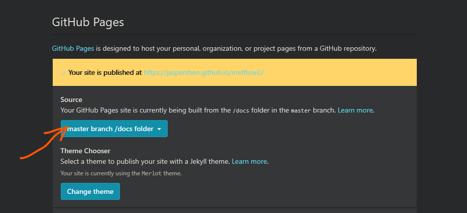
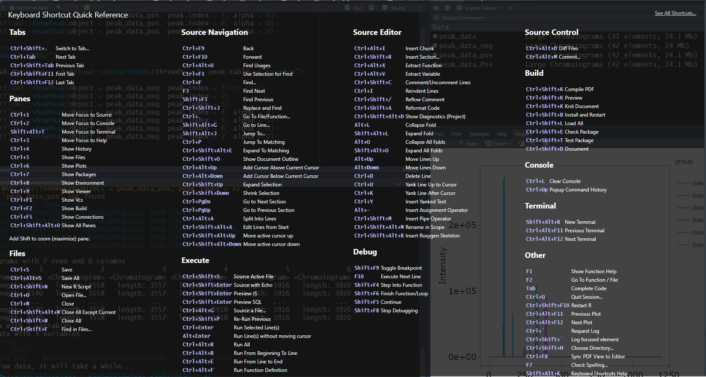

Rstudio快捷键总结,仅限于windows.

完整版可以在Rstudio `Help`找到.

file:///D:/software/R/RStudio/www/docs/keyboard.htm

# Tab(标签)

Shortcut | Function
---------|--------
`Ctrl+Shift+.`|切换标签
`Ctrl+Tab`|切换到下一个标签
`Ctrl+Shift+Tab`|切换到上一个标签
`Ctrl+Shift+F11`|切换到第一个标签
`Ctrl+Shift+F11`|切换到最后一个标签

# Panes(窗口,窗格)

Shortcut | Function
---------|--------
`Ctrl+1`|光标转移到`Source`窗口
`Ctrl+2`|光标转移到`Console`窗口
`Ctrl+3`|光标转移到`Help`窗口
`Ctrl+4`|`History`窗口
`Ctrl+5`|`Files`窗口
`Ctrl+6`|`Plot`窗口
`Ctrl+7`|`Packages`窗口
`Ctrl+8`|`Enviorment`窗口
`Ctrl+9`|`Viewer`窗口
`Ctrl+F1`|版本控制`Git`窗口
`Ctrl+F2`|`Build`窗口
`Ctrl+F5`|`Connection`窗口
`Shift+Alt+T`|光标转移到`Terminal`窗口

**上面所有的快捷键,加上`Shift`之后,会最大化该窗口.**

# Files(文件)

Shortcut | Function
---------|--------
`Ctrl+S`|保存当前文件
`Ctrl+Alt+S`|保存所有文件
`Ctrl+Shift+N`|新建R script文件
`Ctrl+O`|打开文件
`Ctrl+W`|关闭当前文件
`Ctrl+Shift+Alt+W`|关闭除当前文件之外的所有文件
`Ctrl+Shift+W`|关闭除所有文件
`Ctrl+Shift+F`|在某个文件夹下的所有文件中进行搜索

# Source Navigation(导航)

Shortcut | Function
---------|--------
`Ctrl+F9`|后退?
`Ctrl+F10`|前进?
`Ctrl+F`|在当前文件中寻找
`F3`|查找下一个
`Shift+F3`|查找前一个
`Ctrl+Shift+J`|查找和替换
`Ctrl+.`|快速到达一个文件或者函数
`Shift+Alt+G`|快速到达文件的某一行
`Shift+Alt+J`|快速跳转到其他部分
`Ctrl+Shift+0`|展示文档的outline
`Ctrl+Alt+Up`|在当前光标的上方添加光标
`Ctrl+Alt+Down`|在当前光标的下方添加光标

