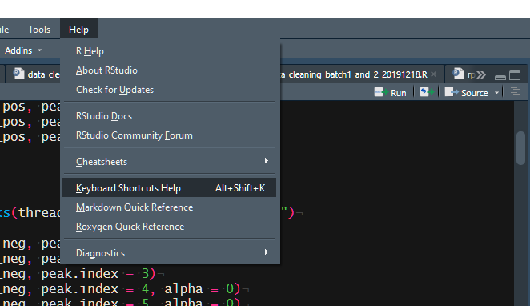

使用`pkgdown`包可以为自己的R包创建说明网站,从而更加方便别人对自己包的立即以及自己对包的管理.

参考网址如下:

https://pkgdown.r-lib.org/index.html

# 安装

```{r, eval=FALSE}
# Install release version from CRAN
install.packages("pkgdown")
# Install development version from GitHub
devtools::install_github("r-lib/pkgdown")
```

# 创建网站

在包的根目录下运行下列代码来创建网站.

```{r, eval=FALSE}
pkgdown::build_site()
```

# 主页(Home page)

主页的内容来自于`README.md`或者`index.md`.

# 文章(Article)

pkgdown自动的将`vignettes`文件夹中的所有的`md`文件转变为aritcles.

# 新闻(NEWS)

在根目录下创建`NEWS.md`文件,然后就会在`Changelog`页面下显示.

# 发布

最简单的方式是在github网页的`setting`中,直接将`docs`选为github pages. 

