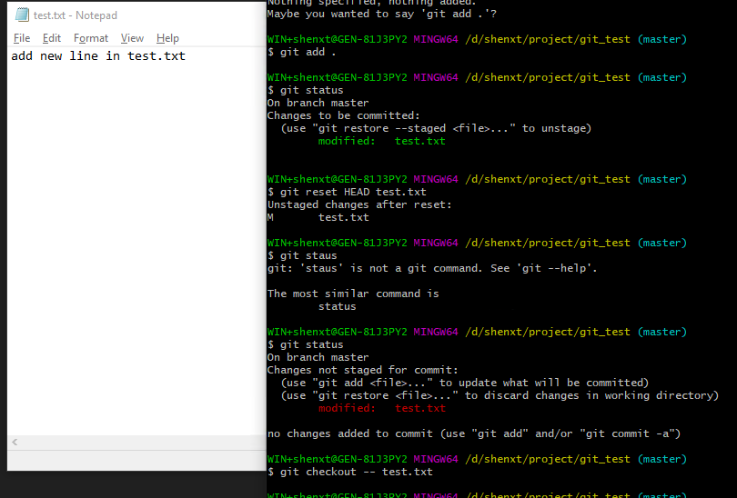
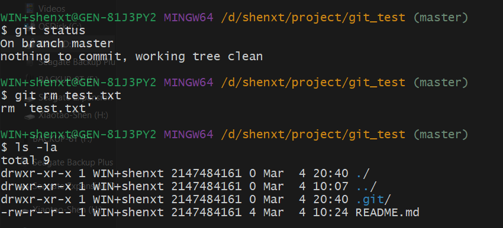
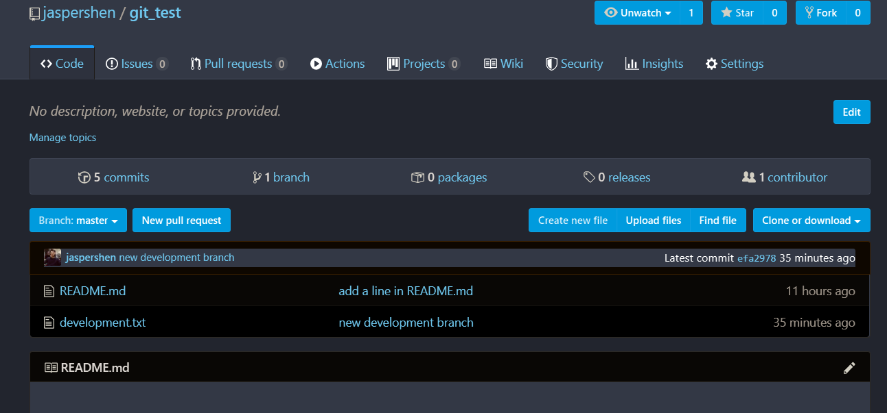

# Git配置

## 安装git之后,需要进行一些全局设置,比如用户名邮箱.

设置的主要命令是`git config`:

```
git config --global user.name "your name" 
git config --global user.email "your email" 
```
其中,`--global`是指全局配置,如果不写,则只为当前仓库(repository)配置.

如果有多个git用户,这时候需要先确定某个仓库使用的哪个账户.

```
git config user.name
git config user.email 
```

查询全局的git账户信息:

```
git config --global user.name
git config --global user.email 
```

## 除了用户名邮箱之外,也可以对其他内容进行配置,如:

```
git config --global color.ui true #让git显示不同的颜色
git config cor.ignorcase true #让git对仓库中文件大小写敏感
```

## 查看所有的配置

```
git config -l
```

# 基础操作

## 创建本地git版本库

使用`git init`命令.

首先,创建一个你要当作仓库的文件夹,然后将其设置为工作路径,然后执行.

```
mkdir git_test
cd git_test
git init
```


这时候查看目录结构,就可以看到创建了一个名为`.git`的子目录,这就说明创建版本库成功了.


## 将文件添加到版本库

要将一个文件纳入到版本管理,首先需要将其添加到暂存区,然后才能提交到仓库中.

### 使用`git add`命令将文件添加到暂存区:

比如我们首先新建一个名为`README.md`的文件,然后将其添加到暂存区.

```
git add README.md
```
当然也可以使用下面命令将所有修改添加到暂存区:

```
git add .
```

`.` 是正则表达式,代表任意文件.但是空文件夹是不会添加到暂存区的.

### 使用`git commit`命令将暂存区文件提交到仓库中.

```
git commit #如果暂存区有文件,则将其中的文件提交到仓库
git commit -m "your note for this commit" #用于注明提交的内容,变更等信息,方便溯源
```


如果直接使用`git commit`提交,不带注释信息,则会先弹出评论界面,需要评论.


注意这时候是使用vi打开的文件,所以需要掌握一点vi的基础知识.参考下面帖子:

https://www.cnblogs.com/itech/archive/2009/04/17/1438439.html


简单来说,首先在命令行模式下按下字母`i`进入插入模式,在该模式下进行信息的输入.输入结束之后,点击`ESC`退回到命令行模式,然后再输入冒号(`:`).输入w,回车,保存,然后输入q,回车,退出vi编辑器.


## 查看仓库状态

不论我们是新建了文件,将文件加入暂存区,或者是其他修改等,我们都可以使用`git status`来查看当前的仓库状态.

如果当前没有任何变动.


如果我们新建了一个文件,然后再次查看状态:

因为我们还没有将其添加到暂存区,因此显示该新建文件为 `Untracted files`


将文件放入暂存区,然后再查看状态:


然后再将其进行提交,查看状态.


## 查看仓库中的具体修改

如果做过之后修改,我们忘了做了哪些修改,可以使用`git diff`命令来查看具体修改内容.

```
git diff #查看所有改动
git diff README.md #查看具体文件的改动
```
比如我们再`test.txt`文件中加入一行,然后查看:


可以看到记录了对该文件的修改内容.

> 注意,如果你修改之后已经将其存入暂存区,则`git diff`不会再显示内容.


## 查看提交的历史记录

有的时候,你需要查看自己做过哪些提交(commit),来回顾自己的完成部分,这时候需要使用`git log`命令.

```
git log     #显示所有提交的历史记录
git log --pretty=oneline    #单行显示提交历史记录的内容
```


可以看到我们现在一共进行了4次提交,每次提交的第一行commit之后是该次提交的唯一`ID`.然后后面显示提交者,时间以及一些记录等.

如果提交非常多,需要显示内容精简一些,就需要使用`git log --pretty=oneline`命令.


## 版本回退

有了`git log`来查看提交的历史记录,我们就可以通过`git reset --hard`来退回到我们需要的某个特定把呢不能.

```
git reset --hard HEAD^        # 回退到上一个提交版本
git reset --hard HEAD^^        # 回退到上上一个提交版本
git reset --hard 'commit_id'    # 会退到 commit_id 指定的提交版本
```
使用`git log`我们可以看到每个提交都有一个唯一的commit ID,其中上一个也可以使用`HEAD`代表.因此我们可以退回到上一个版本.比如,我们在最近的一次提交中修改了test.txt,在其中加入一行.


我们想退回到上一个版本,不想加入这一行,可以使用下面命令.


```
git reset --hard HEAD^
```

这时候再查看log,可以看到最近的一个commit已经消失,回到了上一个提交.而上一次的修改也已经消失.


## 回到未来某个版本

退回到原来某个版本之后,如何再回到未来某个版本呢?还是使用`git reset --hard`命令,但是此时使用`git log`命令是无法显示在这之后的提交信息的。但是，通过`git reflog`可以获取到操作命令的历史。


这时候只要在使用`git reset`命令就可以回到未来的任意一个版本了.而且这时候再使用`git log`也回到了最初的版本提交记录.


## 撤销修改

撤销修改同样包括两方面的内容，由于仓库中的文件在提交之前，可能在工作区中(也就是还未运行 `git add`命令)，尚未在版本控制范围内，也可能在暂存区中(也就是运行了`git add`命令但是没有运行`git commit .`命令)。

### 丢弃工作区中的文件修改

使用如下命令.

```
git checkout -- READ.md    #如果 READ.md 文件在工作区，则丢弃其修改
git checkout -- .            #丢弃当前目录下所有工作区中文件的修改
```

比如我们再`test.txt`中添加另外一行,然后不加入暂存区,然后将其丢弃掉.


然后运行:

```
git checkout -- test.txt
```


### 丢弃暂存区的修改

如果已经运行了`git add`将修改放入了暂存区,可以通过下列命令进行丢弃:

```
git reset HEAD README.md #将 README.md 恢复到 HEAD 提交版本的状态
git checkout -- README.md
```


然后将其删除掉.




## 删除文件

在文件未添加到暂存区之前,对想删除文件可以直接物理删除.或者通过`git checkout -- file`来丢弃.如果文件已经被提交,则需要`git rm`来删除.

```
git rm Readme.md #删除已经提交(commit)过的文件
```

> 注意: `git rm`只能删除已经提交到版本库中的文件.其他状态的文件直接用这个命令操作是出错的.




# git的分支管理

分支管理是版本管理中的重要概念.在进行多个并行作业时,我们经常会用到分支.在这类并行开发的过程中,往往同时存在着多个最新的代码状态.

master分支时git默认创建的分支.因此基本上所有的开发都是以这个分支为中心进行的.

在不同分支中,可以同时进行不同的作业,等该分支的作业完成之后,再与master分支进行合并.

比如下图中,我们首先以master作为模板复制得到`feature A`的分支.`feature A`分支主要用来开发另外一个新的特性,等开发完毕之后,再将其合并到master分支中即可.


## 查看分支

使用`git branch`命令查看分支信息.

```
git branch        #查看本地分支信息
git branch -v     #查看相对详细的本地分支信息
git branch -av     #查看包括远程仓库在内的分支信息
```


可以看到我们现在只有一个分支,也就是master,然后星号标识的就是当前所在的分支.

## 创建分支

使用 `git branch new.name`用来创建新的分支.

```
git branch development ##创建一个新的名字叫做development的分支
```

> 需要注意的是,在哪个分支下面新建分支,则该分支就是copy自当前所在的分支.

## 切换分支

使用`git checkout`命令来切换分支.比如我们先新建一个development的分支,然后切换到该分支下.

```
git branch development
git checkout development
```

当然也可以使用下面命令直接创建并切换到新建的分支下.

```
git checkout -b development
```


我们下面在development分支下面再新建一个`development.txt`文件,然后写入一些内容.


可以看到此时有一个新建的development.txt文件.如果我们切换到master分支,还是有该文件,但是对该文件内容进行修改,则因为没有加入到暂存区,因此并不会进行版本控制.

## 合并分支(merge)

当我们修复完成一个Bug,或者开发完成一个新特性,我们就会把相关的Bug或者特性的上修改合并回原来的主分支上.,这时候就需要`git merge`命令来做分支的合并.

首先需要切换回最终需要合并的分支,也就是`master`分支,然后再合并.

```
git checkout master        #切换回 master 分支
git merge development     #将development分支中的修改合并回master分支
```


## 删除分支

当之前创建的分支,完成了它的使命,如Bug修复完,分支合并以后,这个分支就不在需要了,就可以删除它.

```
git branch -d development #删除development分支
```

# 远程仓库(GitHub)

上面的所有命令都是针对本地仓库的操作.当我们希望多个人来协作时,会将代码发布到一个统一的远程仓库,然后多个人在本地操作以后,再推送到远程仓库.其他人协作时,需要先同步远程仓库的内容,再推送自己的修改.这就要用到了我们最常用的github.

## 添加到远程仓库

比如我们上面所建立的`git_test`本地仓库,我们需要将其添加到github的远程仓库中.

```
git remote add origin your_remote_git_repo #为本地仓库添加远程仓库
```
其中`your_remote_git_repo`是再github中创建的.我们先创建一下,然后进行尝试.

格式为`git@github.com:user.name/repo_name`.
当然,也可以直接使用远程仓库的网址:

https://github.com/jaspershen/git_test


## 推送到远程仓库

使用`git push`将本地仓库的内容推送到远程仓库.

```
git push -u origin master #第一次推送时使用,可以简化后面的推送或者拉取命令使用
git push origin master #将本地master分支推送到origin远程分支
```


以后再推送的时候,就使用`git push`就可以了.

这时候可以看到github中已经有了内容.



## 从远程仓库获取最新内容

在多人协作过程中,当自己完成了本地仓库中的提交,想要向远程仓库推送前,需要先获取到远程仓库的最新内容。

可以通过`git fetch`和`git pull`来获取远程仓库的内容.

```
git fetch origin master    
git pull origin master
```

两者之间的区别:

* `git fetch`是仅仅获取远程仓库的更新内容,并不会自动做合并.

* `git pull`在获取远程仓库的内容后,会自动做合并,可以看成`git fetch`之后`git merge`.

## 查看远程仓库信息

```
git remote -v
```

## 从远程仓库克隆

如果你本地没有仓库,希望从已有的远程仓库上复制一份代码,那么你需要`git clone`.

```
git clone https://github.com/jaspershen/git_test #通过 https 协议,克隆Github上git仓库的源码
git clone jaspershen@github.com/git/git_test #通过ssh协议,克隆Github上git仓库的源码
```


# 设置忽略文件

有时候仓库中的某些文件或者文件夹并不需要进行同步,这时候可以通过设置忽略文件`.gitignore`进行管理.

参考帖子:

https://github.com/onlynight/ReadmeDemo/tree/master/Readmes/GitIgnore
