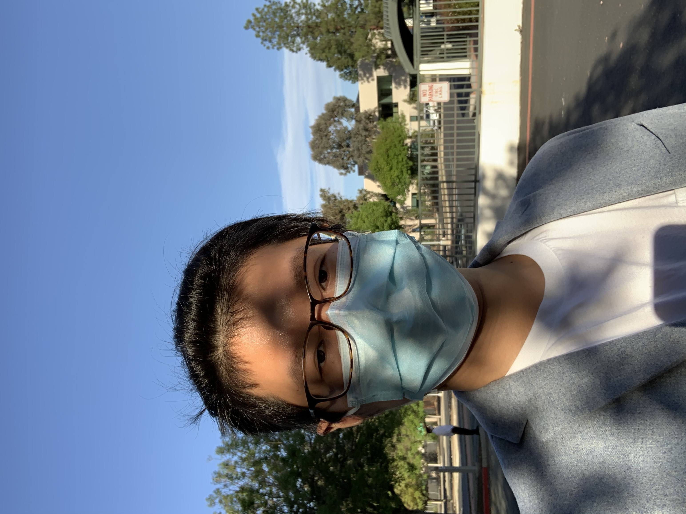

王博士从quarantine第一天就开始记录隔离日记,我也从今天开始记录.虽然已经都快两个月了.只能期望赶紧结束,恢复正常的生活.

因为王博士有事情需要去学校,并且她还有通行证,我也我也跟着蹭着证明过去了.上午还是在家里办公,效率仍然不高.然后中午吃完饭之后,才开车到了main campus.

王博士今天做的馒头,技术越来越进步了,发到群里面,得到了大家一致的赞赏.

现在main campus的办公室工作了一会,然后今天是周五,又到了`currect topics on data sciences and omics`,今天是bingqing讲有关epigenetics的相关知识,以前经常在文献中看到,今天终于了解了一些基本的概念.

随后跟着王博士到porter drive测样品,在外面自拍了一张,发现真的是越来越胖,跟王博士一起,真的成合肥了....

给家里打了电话,我姐跟非凡又到家里去了,突然发现王非凡跟我姐长得有点像.都已经四岁了,希望等我什么时候回家了,这帮孩子们都长大懂事了吧.

第一天有点匆忙,希望后面记录的更仔细一些.

