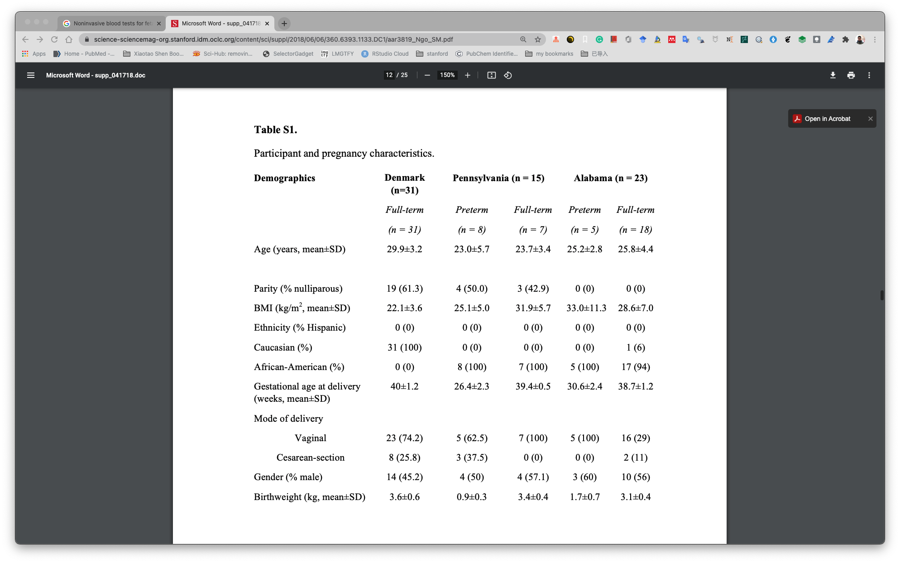

# 文献题目:

Noninvasive blood tests for fetal development predict gestational age and preterm delivery

# Summary

> Noninvasive blood tests that provide information about fetal development and gestational age could potentially improve prenatal care. Ultrasound, the current gold standard, is not always affordable in low-resource settings and does not predict spontaneous preterm birth, a leading cause of infant death. In a pilot study of 31 healthy pregnant women, we found that measurement of nine cell-free RNA (cfRNA) transcripts in maternal blood predicted gestational age with comparable accuracy to ultrasound but at substantially lower cost. In a related study of 38 women (25 full-term and 13 preterm deliveries), all at elevated risk of delivering preterm, we identified seven cfRNA transcripts that accurately classified women who delivered preterm up to 2 months in advance of labor. These tests hold promise for prenatal care in both the developed and developing worlds, although they require validation in larger, blinded clinical trials.

## Results

31个pregnant women,mothly sampling.共有521个plasma samples.所有women都是full term (delivery GA >= 37 weeks).记录了medicine. 强调了: 

> and their medical records showed no unusual health changes during pregnancy (table S1).

但是table S1中并没有记录.

测cfRNA时,特异性的只测量某些:

> Each sam- ple was analyzed by highlymultiplexed real-time polymerase chain reaction (PCR) using a panel of genes with expression specific to the placenta or to the immune system, or highly enriched in the fetal liver (table S2).

某些placental(胎盘)cfRNA在delivery之后就无法测量到.

> Placental cfRNAs and several fetal liver cfRNAs were not detected above the noise floor after delivery, which sup- ports their pregnancy-derived origin; some fetal liver transcripts were also expressed in the adult liver, and we observed a small maternal baseline for this subset. cfRNAmeasurements

跟immune system相关的cfRNA在GA期间逐渐升高,然后delivery之后恢复到正常水平,说明在GA期间主要是有怀孕引起的升高.

> cfRNAmeasurements correspond- ing to immune system–related genes increased during gestation and showed a return to measurable baselines after delivery, which supports their predominantly maternal origin.

BMI并不影响到cfRNA的含量.将women分为几组,然后使用wulcoxon test检验.

> We have tested for the effect of BMI on circulating cfRNA levels using estimated
transcript counts of GAPDH per milliliter of plasma and found no significant difference
between underweight (BMI < 18.5), normal weight (18.5 ≤ BMI < 25), overweight (25 ≤
BMI < 30), and obese (BMI ≥ 30) individuals both before and after Bonferroni correction
using a Wilcoxon rank sum test. 

> P-values for distinct tests of GAPDH levels before and after Bonferroni correction,
respectively, were as follows: (1) underweight versus normal weight (P = 0.58, 1),
underweight versus overweight (P = 0.12, 0.80), underweight versus obese (P = 0.26, 1),
normal weight versus overweight (P = 0.06, 0.35), normal weight versus obese (P = 0.16,
0.95), and overweight versus obese (P = 0.72, 1). Similar results were obtained for
placental-specific cfRNAs such as CAPN6, CGA, and CGB.

> All comparisons were done within cohorts so that differences in BMI distribution
between cohorts were not confounding. 

建立预测GA模型,使用了RF模型,徐哪去最后九个cfRNA作为maker.预测效果跟使用所有51个cfRNA相差无几.预测效果随着GA增加而变好.third trimester效果最好.

> We then built a random forest model to predict time from sample collection until delivery, using cfRNA measurements as the primary fea- tures. We also found that model performance improved significantly over the course of pregnancy, as measured by root mean squared error (RMSE) for both training [RMSE = 6.0 (first trimester, T1), 3.9 (second trimester, T2), 3.3 (third trimester, T3), 3.7 (postpartum, PP) weeks] (Fig. 2C) and validation sets [RMSE = 5.4 (T1), 4.2 (T2), 3.8 (T3), 2.6 (PP) weeks] (Fig. 2D). Although

