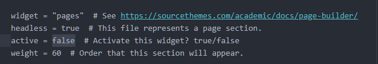
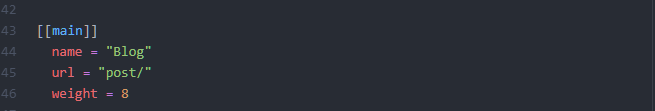
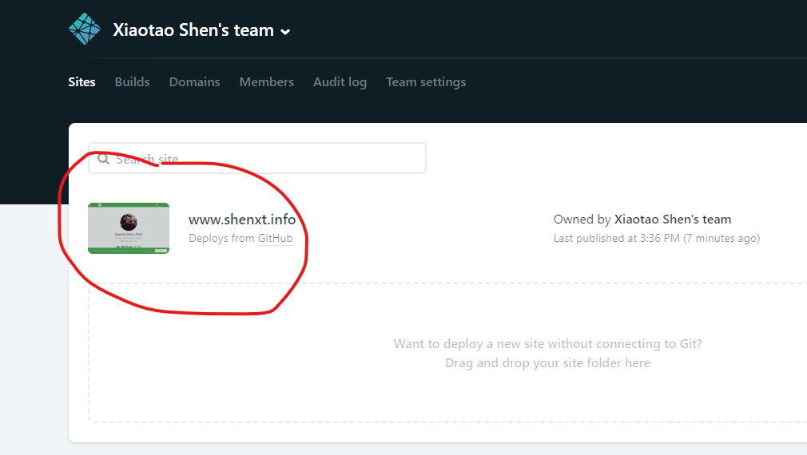
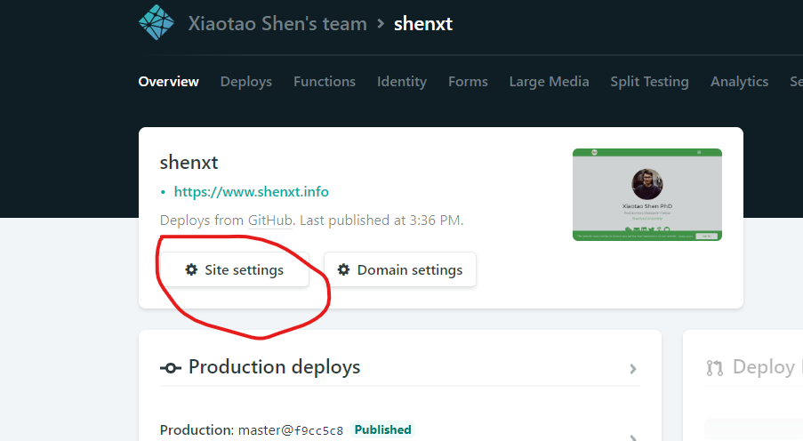
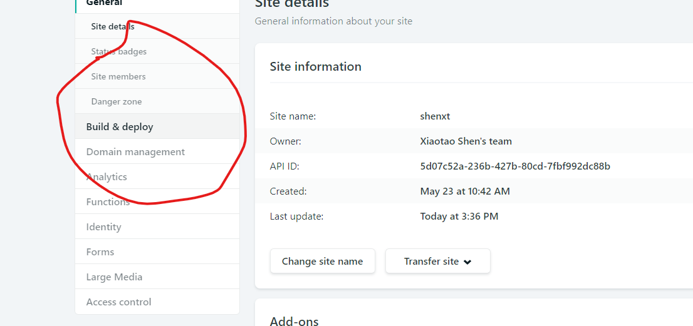
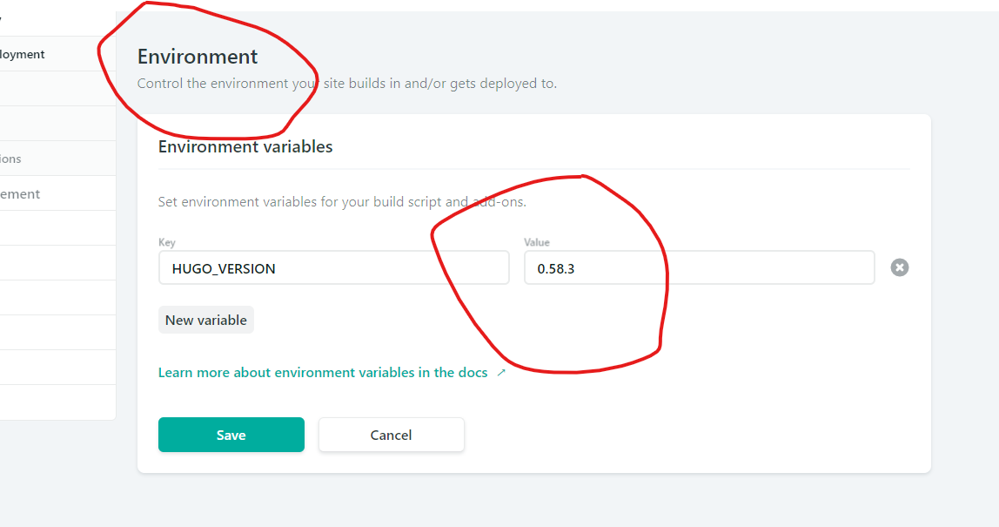
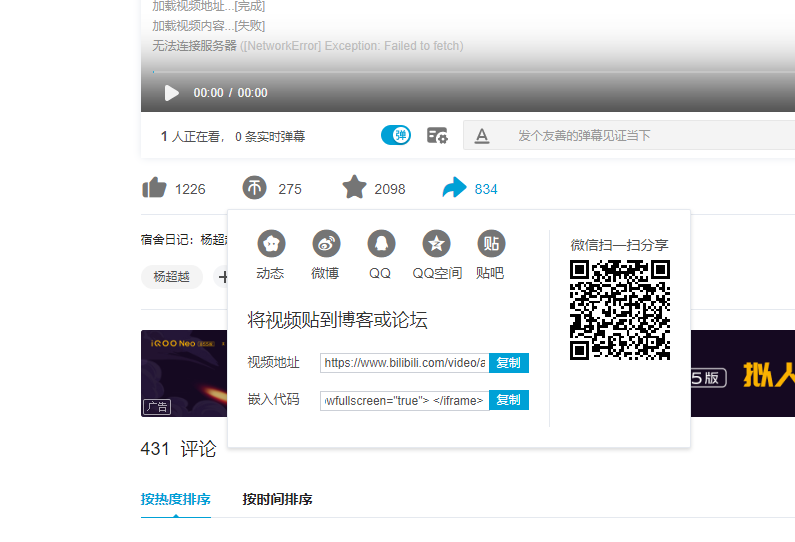

# 如何修改网站icon?

将自己的logo图片截取为192x192像素(长款分别为0.21cm).然后将其命名为'icon-192.png'放置于`static/img`文件夹中即可.

# 如何将个人网站作为图床使用?

将图片放置于`static/files`文件夹中即可.使用如下路径访问:   

`shenxt.info/files/figure.name`

如: https://www.shenxt.info/files/wechat_QR.jpg

# 如何将某个部分(如博客blog)不显示在主页(home)上,而是点击之后,打开一个单独的page?

以blog为例(posts).

1. 首先需要将 `content/home`中的`posts.md`中的active设置为false.这样,这一部分就不会在home主页显示.



2. 然后将`content/home`中的`posts.md`拷贝到`content/post`中,并改名为`index.md`.

3. 打开`config/_default/menus.toml`,然后将Blog的url修改为文件夹的名称.



# 如何添加新的页面?

以在我的网页添加新的中文入口为例.

在`conternt`文件夹下面创建新的`chinese`文件夹.在该文件夹下面创建`_index.md`文件.

# 如何在post中添加本地图片?

首先在`content/post/`建立和post名z字去除掉数字之后的的文件夹(比如post名字为`2019-10-25-test`,则文件夹命名为`test`),然后再在该文件夹下建立和post同名的文件夹(`2019-10-25-test`),然后将图片(如`test.png`)放入该文件夹下.在post中,使用:

``语句插入图片.

# 如何在Rmarkdown中添加table of contents?

在每篇`Rmarkdown`的`YAML`添加如下内容:

```
output:
  blogdown::html_page:
    toc: true
    number_sections: true
```

# netlify自动部署(deploy)failed的问题

发现自动部署总是失败.查了一下,应该是本地的`Hugo`和netlify上的版本不一致,解决方法如下:

首先,在R console输入下列语句,查看本地`Hugo`版本:

```{r}
blogdown::hugo_version()
```

然后修改netlify上的`Hugo`的版本.

## 打开netlify网站: 

点击下面网站:

https://app.netlify.com/teams/jaspershen/sites

然后点击托管的自己的网站.




## 点击`Site settings`



## 点击`Build & deploy`




## 修改`Hugo version`

然后点击`Environment`,将HUGO_VERSION版本修改为和本地一致的版本.



# 将网站改为中英双文之后,新建`post`报错

暂时没有找到好的解决办法.现在的问题是,使用`new_post()`创建新的博客,默认的根路径就在`content\en`中,但是默认的打开路径又在`content\zh`中.所以无法解决.现在只能使用copy其他博客新建来解决了.

## 新建blog的`YAML`如下:

```
---
title: test
author: Xiaotao Shen
date: '2019-10-13'
slug: ''
categories:
  - R
tags:
  - Blog
image:
  caption: ''
  focal_point: ''
output:
  blogdown::html_page:
    toc: true
    number_sections: true
---
```

## 常用的categories:

1. docker   
3. life    
4. literature    
5. Mass Spectrometry    
6. omics   
7. R    
8. Study    

## 常用的tags:

1. Academic   
2. Biomarker discovery    
3. Blog   
4. Chinese    
5. Data cleaning    
6. Data processing    
7. Github   
8. life   
9. Lipidomics   
10. Metabolomics   
11. Software   
12. Source Thermes   
13. Statistical analysis   
 
 
# 如何在post(markdown)中插入Emojis

完整的emoji名单在这:

https://www.webfx.com/tools/emoji-cheat-sheet/

输入:

```
I : heart : Academic : smile :
```
注意需要把emoji文字和两边的冒号之间的空格去除掉.

显示:

I :heart: Academic :smile:

# 如何在post中插入视频?

## 如何插入B站视频?

参考下面帖子.

https://fengxiao.ml/2018/12/27/133.html.

点开想要插入的视频,点击分享.然后点击`嵌入代码`,复制代码,插入到markdown文件中即可.



但是直接嵌入的视频长宽不太好,所以需要手动调整.

首先需要设置宽度位100%.并给其设置一个id.如下面我就设置ID位`test`.

```
<iframe id="test" src="//player.bilibili.com/player.html?aid=23877090&cid=39940519&page=1" scrolling="no" border="0" frameborder="no" framespacing="0" allowfullscreen="true" width=100%> </iframe>
```

然后需要在markdown中插入下面的JS代码:

```
<script type="text/javascript">
document.getElementById("test").style.height=document.getElementById("test").scrollWidth*0.76+"px";
</script>
```

<iframe id="test" src="//player.bilibili.com/player.html?aid=23877090&cid=39940519&page=1" scrolling="no" border="0" frameborder="no" framespacing="0" allowfullscreen="true" width=100%> </iframe>

<script type="text/javascript">
document.getElementById("test").style.height=document.getElementById("test").scrollWidth*0.76+"px";
</script>

## 在markdown中

直接使用下面语句,插入到markdown中即可.

### A video from your static/img/ media library:

```

```

### A video within a page's folder (e.g. content/post/hello/):

```


```

### Youtube:
```

```

### Vimeo:
```

```

## 在Rmarkdown中

使用`shortcode()`函数.

### 本地视频

将视频放入在与post相同的文件夹中.

然后插入下面语句(注意是要放在r代码框中):

```{r, eval=TRUE}
blogdown::shortcode("video", src = "./test.mp4")
```

### Youtube视频

使用下面语句可以插入视频.第二个是youtube视频ID.

```{r, eval=TRUE}
blogdown::shortcode("youtube", "p4liifrbK8w")
```

# 如何在post中插入icon?

直接使用HTML语句即可.

```
<i class="fab fa-weixin"></i>
```

显示:

<i class="fab fa-weixin"></i>

其中fab是这个网站:

https://fontawesome.com/icons?d=gallery

找到你想要的icon之后,复制名字,替换掉即可.

如果该网站没有,还可以使用下面的网站:

https://getbootstrap.com/docs/3.3/components/

输入:

```
<i class="fas fa-adobe"></i>
```

显示:

<i class="fas fa-hourglass"></i>
