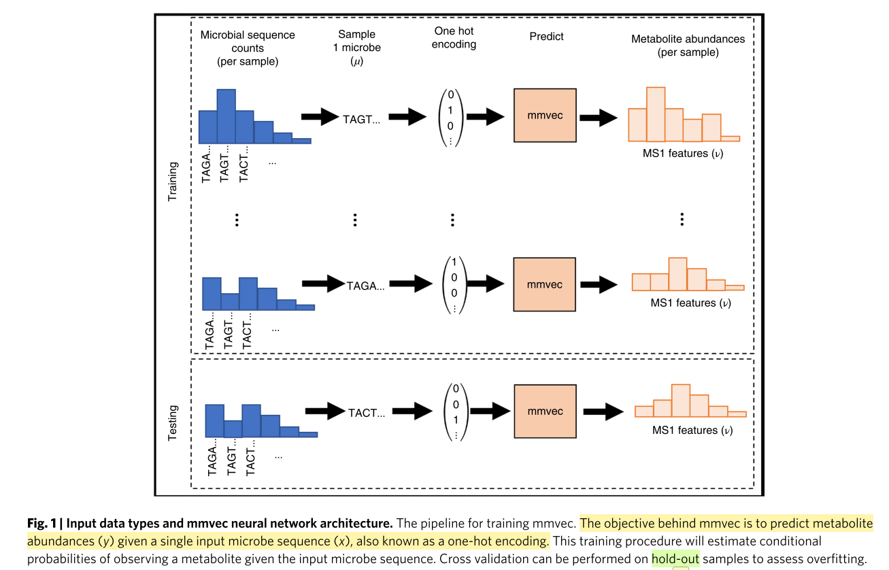

文章题目:

Learning representations of microbe–metabolite interactions

文章Supplementary

https://static-content.springer.com/esm/art%3A10.1038%2Fs41592-019-0616-3/MediaObjects/41592_2019_616_MOESM1_ESM.pdf

这篇文章中的interactions across omics就是指在统计学意义上的两个变量的关系,如相关性.

microbe-metabolite relationship就是指微生物和metabolite的相关性.

# Abstract

Previous work has been able to predict metabolite abundance profiles from microbe abundance profiles[^1] [^2]. However, because conventional correlation techniques have unacceptably high false-discovery rates, finding meaningful relationships between genes within complex microbiomes and their products in the metabolome is challenging.

传统的correlation计算方法有着非常大的错误发现率,因此发现microbe和他们的product metabolite还是非常具有挑战性的.

Relative abundances of thousands of microbes and metabolites can be measured using sequencing technology and mass spectrometry, respectively, resulting in the generation of high-dimensional microbiome and metabolomics datasets. 

microbiome得到的定量信息也是relative abundance.对于metabolome数据,能够测到的metabolite依赖于提取的方法以及分析方法,因此其实我们得到的metabolome是a partial snapshot of the metabolome.并不完全的完整的.

Quantifying microbe–metabolite interactions from these abundances requires estimating a distribution across all possible microbe–metabolite interactions.

从相对定量的数据中得到microbe-metabolite interactions需要得到所有的microbe–metabolite interactions的分布.是否可以理解为需要由NULL分布,然后才能知道某个interaction是不是真的interaction?

Pearson’s and Spearman’s correlations assume independence between interactions.

我们常用的correlation方法假设两个变量之间的关系和其他的变量是独立的,这是不一定的.所以还有一种办法叫做偏相关性.

作者举了例子来说明,为什么使用传统的correlation数据会早成错误发现(假阳性或者假阴性).

我并没有看懂他是什么意思?

在microbome和metabolite中会有使用某个变量占所有变量的比例来表示这个变量的吗?

好像并没有啊.

**scale invariance**什么意思?标度不变.

An alternative approach is to consider co-occurrence probabilities instead of correlations. 

一个可替代的方法是考虑共出现的概率而不是相关性.

Here, co-occurrence probabilities refer to the conditional probability of observing a metabolite given that a microbe was observed, thereby allowing us to identify the most likely microbe–metabolite interactions.

共出现概率是指当一个microbe(细菌)在的时候,观察到某个代谢物的条件概率.从而能够鉴定到真正的microbe-metabolite interaction.

To do this, we propose ‘mmvec’, (microbe–metabolite vecors), a neural network that predicts an entire metabolite abundance profile from a single microbe sequence.

因此作者提出了`mmvec`(microbe–metabolite vecors)概念.利用neural network从一个single microbe的sequence来预测整个的metabolite abundance.

这幅图是指如何使用microbe sequence去预测metabolite abundance.

Through iterative training, mmvec can learn the co-occurrence probabilities between microbes and metabolites. The microbe–metabolite interactions can be ranked and visualized through standard dimensionality reduction interfaces, enabling interpretable findings.

其实就是给定microbe的中的一个sequnce之后,预测所有metabolite abundance.

# Results

# Reference

[^1]: Noecker, C. et al. Metabolic model-based integration of microbiome taxonomic and metabolomic profiles elucidates mechanistic links between ecological and metabolic variation. MSystems 1, e00013–e00015 (2016).

[^2]: Mallick, H. et al. Predictive metabolomic profiling of microbial communities using amplicon or metagenomic sequences. Nat. Commun. 10, 3136 (2019).

