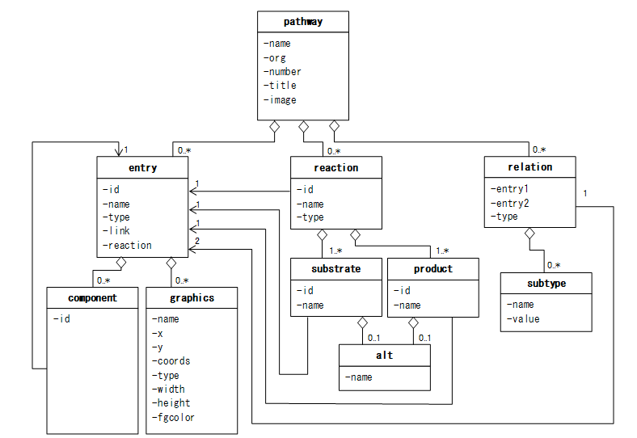

# KEGG Pathway数据库

KEGG pathway的数据是使用`KGML`(KEGG Markup Language)格式存储下来的.详细的信息可以阅读官方文档.

https://www.kegg.jp/kegg/xml/docs/

## 背景

KEGG pathway有两个类型.

* **reference pathways**: 手动画的.

* **organism-specific pathways**: 使用计算方法自动从reference pathway得到的.

在`KGML`文件中,`entry`指的是node,而`relation`和`reaction`指的是整个网络的边.在KEGG pathway中,矩形表示基因(也可以认为是gene的产物蛋白质),而circle代表的是metabolite.

如果网络中只有`entry`和`relation`,则该网络称为`protein network`.如果只有`entry`和`reaction`,则称为`chemical network`.

所以一般来说,可以用两种方式来表示metabolic pathway:

1. metabolic pathways viewed as both protein networks and chemical networks and

2. regulatory pathways viewed as protein networks only.

## `KGML`的overview



这幅图是整个`KGML`的总览.

## 如何获得某个pathway`KGML`文件

使用R包`KEGGlincs`可以下载pathway的`KGML`文件.

```{r, message=FALSE, warning=FALSE}
library(tidyverse)
library(KEGGREST)
library(KEGGlincs)
###
#获得所有has的pathway ID
path_id <- KEGGREST::keggList(database = "pathway", 
                              organism = "hsa")
head(path_id)
path_id <- 
  path_id %>% 
  names() %>% 
  unique() %>% 
  stringr::str_replace("path:", "")
head(path_id)

##下载kgml文件并进行解析
temp_kgml <- 
  KEGGlincs::get_KGML(pathwayid = path_id[1])
class(temp_kgml)
temp_kgml
```

`get_KGML()`函数其实分别使用了`KEGGREST`包中的`keggGet()`函数来下载的,然后使用`KEGGgraph`包中的`paraseKGML()`函数来解析.

```{r}
temp_kgml2 <-
  KEGGREST::keggGet(dbentries = path_id[1], option = "kgml")
class(temp_kgml2)

temp_kgml2 <- 
  KEGGgraph::parseKGML(file = temp_kgml2)
temp_kgml2
```

## Pathway

### Pathway element

一共有六个属性.

```{r,echo=FALSE}
kableExtra::kable(x = 
                  data.frame(
                    Attribute.name = c("name", "org", "number", "title", "image", "link"),
                    Explanation = c("Pathway的ID", "ko/ec/或者物种的简称","该pathway的ID numebr",
                                    "pathway的title,名称",
                                    "pathway的图片的下载link",
                                    "该pathway的link"),
                    stringsAsFactors = FALSE
                  )
                  )

```


