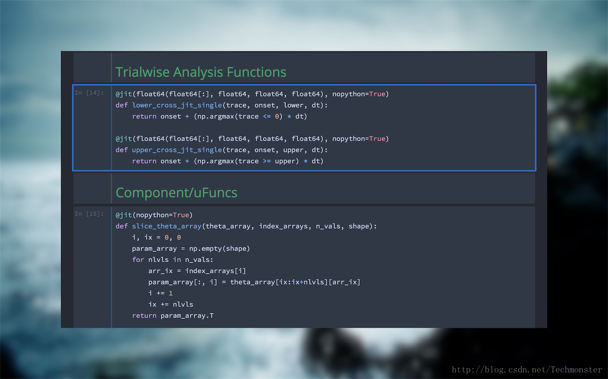
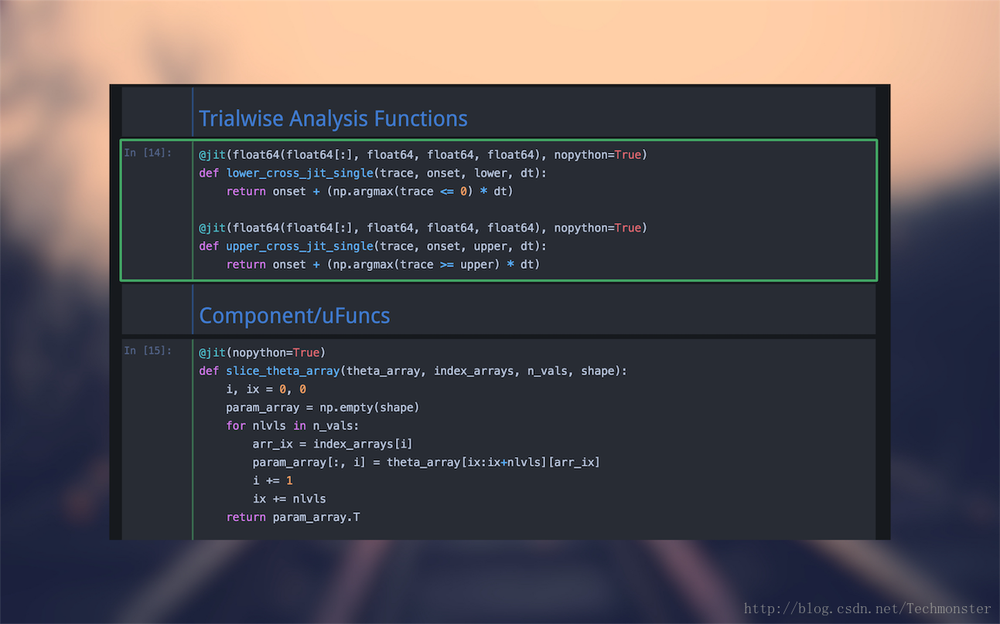
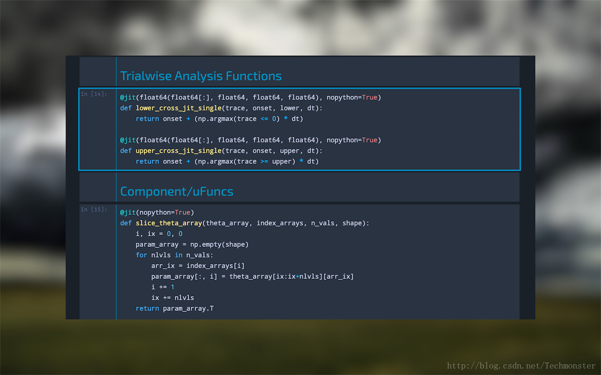
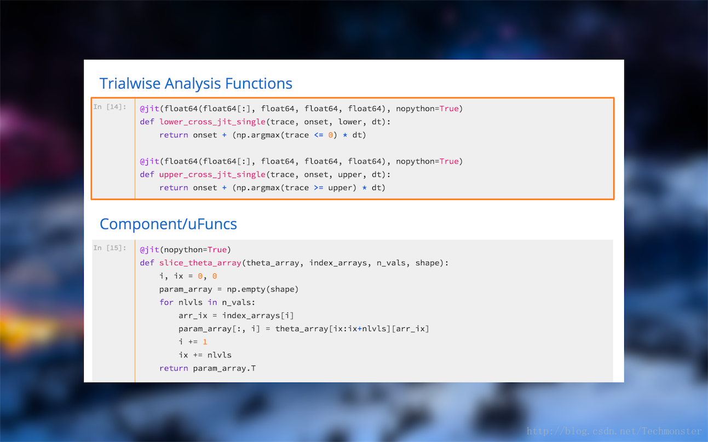
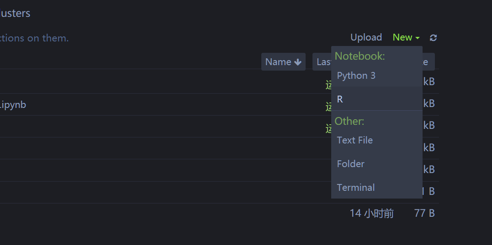

# 基础

# Pycharm cookbook

## 注释快捷键

`ctl+/`


## 将project上传到github

参考下面帖子:

https://www.cnblogs.com/feixuelove1009/p/5955332.html


## 如何更改每个项目的解释器版本?

File -> Settings ->project -> Project Interpreter

然后选择即可.

## 创建文件

File -> new

## 运行代码

可以一行行的运行代码,修改默认快捷键位`ctl+enter`

## 修改默认的快捷键

在File ->keymap下

## 编码设置

需要将pycharm的所有编码设置为`UTF-8`.

1. File -> Setting -> Editor -> File Encoding


同时在每个文件的开头添加:

```
#-*- coding: utf-8 -*
```

# Jupyter notbook

## 修改工作路径

打开默认时C盘.在Win中可以按照下面方法修改路径.

```
D:
cd ...
```

然后使用下列命令启动`jupyter notebook`

```
jupyter notebook
```

## 在某个文件夹下面打开jupyter botebook

直接在某个文件夹下面,`shift + right click`,选择`open powershell window here`,然后输入`jupyter notebook`即可.

## 修改jupyter note主题

### 首先安装`jupyter-themes`

```
pip install --upgrade jupyterthemes
```

### 查看所有可使用主题

```
jt -l
```

### 更改主题

```
jt -t theme_name
```

### 恢复默认主题

```
jt -r
```

### 各主题样式

#### oceans16



#### onedork




#### chesterish



#### grade3



## 在jupyter中使用R

### 关联jupyter notebook

```
install.packages(c('repr', 'IRdisplay', 'evaluate', 'crayon', 'pbdZMQ', 'IRkernel', 'uuid', 'digest'))
# 只在当前用户下安装
IRkernel::installspec()
# 或者是在系统下安装
IRkernel::installspec(user = FALSE)
```

### 打开jupyter notebook

新建,选择R.就可以使用了.



## Jupyter快捷键

### 命令行模式(按`Esc`生效)

Shortcut | Function
---------|---------
`M`|把代码块变成标签
`Y`|把标签变成代码块
`X`|剪切选择的代码块
`A`|在上面插入代码块
`B`|在下面插入代码块
`Z`|撤销删除


