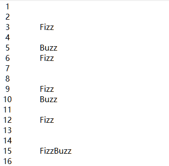

```{r setup, include=FALSE}
library(reticulate)
```

# 条件,循环及其他语句

## `print`和`import`函数

### 打印多个字符串

需要将多个要打印的字符串用逗号隔开.

```{python}
print('Age:', 42)
```

默认字符串之间的分隔符为空格.可以使用`sep`参数自定义.

```{python}
print("I", "am", "Xiaotao Shen")
print("I", "am", "Xiaotao Shen", sep = ",")
```


### 使用`import`导入模块

导入模块一般使用如下语句:

```
import somemodule
from somemodule import somefunction
from somemodule import somefunction, anotherfunction, yetanotherfunction
from somemodule import *
```

最后一种是导入该模块的所有函数.

如果某个函数名在两个模块种都有,那么使用第一种方式导入模块之后,使用下面方法进行调用:

```
module1.function(...)
module2.function(...)
```

另外一种方法就是在句尾添加as并指定别名.可以将模块或者函数命名为其他名字.

```{python}
import math as foobar
foobar.sqrt(4)
from math import sqrt as foobar
foobar(4)
```

```
from module1 import open as open1
from module2 import open as open2
```

## Python中的赋值

### 序列解包

同时给多个变量赋值:

```{python}
x, y, z = 1, 2, 3
x
y
z
```

**最大的用处在于可以同时交换多个变量的值:**

```{python}
x, y = y, x
print(x, y, z)
```

实际上,这里执行的操作称为序列解包(或可迭代对象解包)：将一个序列(或任何可迭代对象)解包,并将得到的值存储到一系列变量中.下面用例子进行解释.


```{python}
values = 1, 2, 3
x, y, z = values
print(x, y, z)
```

只要是可以用于迭代的对象,比如元组,列表,字典等等,都可以用这种方法.

```{python}
##字典
scoundrel = {'name': 'Robin', 'girlfriend': 'Marion'}
scoundrel.popitem()
key, value = scoundrel.popitem()
key
value

##列表
test = ["a","b","c"]
x, y, z = test
print(x, y, z)

##字符串
x,y,z,w = "shen"
print(x,y,z,w)
```

要解包的序列包含的元素个数必须与你在等号左边列出的目标个数相同,否则Python将引发异常.

如果在左边的某个变量名前面加上型号(*),那么该变量会最终变为一个列表.

```{python}
a, *b, c = "abc"
a
b
c
```

### 链式赋值

链式赋值是一种快捷方式,用于将多个变量关联到同一个值.

```
x = y = somefunction()
```

等价于:

```
x = somefunction()
y = somefunction()
```

### 增强赋值

```{python}
x = 1
x = x + 1
x
```
等价于下列代码:

```{python}
x = 1
x += x
x
```

这种写法在循环中见的会比较多.

## 条件和条件语句

在python中被视为`False`的内容:

```
False None 0 "" () [] {}
```

换而言之,标准值**False和None、各种类型(包括浮点数、复数等)的数值0、空序列(如空字符串、空元组和空列表)以及空映射(如空字典)**都被视为假,而其他各种值都被视为真,包括特殊值True.

布尔值`True`和`False`属于类型`bool`,而`bool`与`list`、`str`和`tuple`一样,都是函数,可用来转换其他的值.

```{python}
bool(1)
bool(0)
x = "a"
x
test = "xiaotao"
test
```

### If语句

这意味着如果条件(if和冒号之间的表达式)为前面定义的真,就执行后续代码块(这里是一条print语句)；如果条件为假.


```{python}
test = "xiaotao"
test
test.endswith("shen")
test.endswith("tao")
if test.endswith("tao"):
   print("Yes")
```


### else子句

如果if语句不成立,可以执行else子句的内容.

```{python}
name = "xiaotao"
name
if name == "xiaotao":
   print("Welcome, Xiaotao")
else:
   print("Hello, stranger")
```

### elif子句

要检查多个条件,可使用`elif`.`elif`是`else if`的缩写,由一个`if`子句和一个`else`子句组合而成,也就是包含条件的`else`子句.


```{python}
name = "shen"

if name == "wang":
   print("Welcome, wang")
elif name == "shen":
   print("Welcome, Xiaotao")
else:
  print("Hello, stranger.")

```

### 更复杂的条件

下面重点说说条件本身.

1. 比较运算符.

在条件表达式中,最基本的运算符可能是比较运算符,它们用于执行比较.

Equation|Meaning
--------|-------
x == y | x等于y
x < y | x小于y
x > y | x大于y
x >= y | x大于或等于y
x <= y | x小于或等于y
x != y | x不等于y
**x is y** | x和y是同一个对象
**x is not y** | x和y是不同的对象
**x in y** | x是容器(如序列)y的成员
**x not in y** | x不是容器(如序列)y的成员

与赋值一样,Python也支持链式比较：可同时使用多个比较运算符,如`0 < age < 100`.

* `is`:相同运算符

他和`==`还是有区别的.

```{python}
x = y = [1, 2, 3]
z = [1, 2, 3]
x == y
x == z
x is y
y is x

x is z
z is y
```

x和z相等,但`x is z`的结果却为False.为何会这样呢?因为is检查两个对象是否相同(而不是相等).变量x和y指向同一个列表,而z指向另一个列表(其中包含的值以及这些值的排列顺序都与前一个列表相同).这两个列表虽然相等,但并非同一个对象.

* `in`:成员资格运算符

* 字符串和序列的比较

字符串是根据字符的字母排列顺序进行比较的.

```{python}
"alpha" < "beta"
```

2. 布尔运算符

`and`, `or`还有`not`.

### 断点用于debug

Python中如何进行诊断和debug.

可以使用关键字`assert`

```
age = 10
assert 0 < age < 100
age = -1
assert 0 < age < 100
```

如果知道必须满足特定条件,程序才能正确地运行,可在程序中添加`assert`语句充当检查点,这很有帮助.

这里类似与R中的`stop()`函数.

```
age = -1
assert 0 < age < 100, 'The age must be realistic
```


## 循环

### `while`循环

```{python}
x = 1
while x <= 10:
  print(x)
  x += 1
```

### `for`循环

为序列(或其他可迭代对象)中每个元素执行代码块,这时候使用`for`循环更加合适.

鉴于迭代(也就是遍历)特定范围内的数是一种常见的任务,Python提供了一个创建范围的内置函数`range`.

```{python}
range(0,10)
list(range(0,10))
```

范围类似于切片.它们包含起始位置(这里为0),但不包含结束位置(这里为10).在很多情况下,你都希望范围的起始位置为0.实际上,如果只提供了一个位置,将把这个位置视为结束位置,并假定起始位置为0.

`range()`函数的使用语法如下:

```
range(start, stop[, step])
```

一共有三个参数,分别是起始,终止和步长.

```{python}
list(range(10))
list(range(0,10))
list(range(0,10,1))
```

### 迭代字典

要遍历字典的所有关键字,可像遍历序列那样使用普通的`for`语句.

```{python}
d = {'x': 1, 'y': 2, 'z': 3}
for key in d:
  print(key, 'corresponds to', d[key])
```

也可使用`keys`等字典方法来获取所有的键.如果只对值感兴趣,可使用`d.values`.你可能还记得,`d.items`以元组的方式返回键-值对.`for`循环的优点之一是,可在其中使用序列解包.

```{python}
d.items()
for key, value in d.items():
  print(key, 'corresponds to', value)
```

### 一些迭代工具

#### 并行迭代

有时候,你可能想同时迭代两个序列.假设有下面两个列表：

```{python}
names = ['anne', 'beth', 'george', 'damon']
ages = [12, 45, 32, 102]
```

一个很有用的并行迭代工具是内置函数`zip`,它将两个序列“缝合”起来,并返回一个由元组组成的序列.

```{python}
test = zip(names, ages)
test
type(test)
test2 = list(test)
test2
type(test2)
```

`zip()`函数用于将可迭代的对象作为参数,将对象中对应的元素打包成一个个元组,然后返回由这些元组组成的列表.如果各个迭代器的元素个数不一致,则返回列表长度与最短的对象相同,利用`*`号操作符,可以将元组解压为列表.

`zip()`函数的使用方法:

```
zip([iterable, ...])
```
`iterabl`:一个或多个迭代器.

```{python}
for name, age in zip(names, ages):
  print(name, 'is', age, 'years old')
```

#### 迭代时获取索引

在有些情况下,你需要在迭代对象序列的同时获取当前对象的索引.例如,你可能想替换一个字符串列表中所有包含子串'xxx'的字符串.

这时候可以使用内置函数`enumerate()`.这个函数让你能够迭代索引-值对,其中的索引是自动提供的.

`enumerate()`函数使用方法:

```
enumerate(sequence, [start=0])
```

* **sequence**: 一个序列、迭代器或其他支持迭代对象.
* **start**: 下标起始位置.

返回 enumerate(枚举) 对象.

```{python}
seasons = ['Spring', 'Summer', 'Fall', 'Winter']
list(enumerate(seasons))
list(enumerate(seasons, start=1))       # 下标从 1 开始
```

#### 反向迭代和排序后再迭代

来看另外两个很有用的函数：`reversed()`和`sorted()`.它们类似于列表方法`reverse`和`sort`(`sorted`接受的参数也与`sort`类似),但可用于任何序列或可迭代的对象,且不就地修改对象,而是返回反转和排序后的版本.

```{python}
sorted([4, 3, 6, 8, 3])
sorted('Hello, world!')
list(reversed('Hello, world!'))
''.join(reversed('Hello, world!'))
```

请注意,`sorted`返回一个列表,而`reversed`像`zip`那样返回一个更神秘的可迭代对象.你无需关心这到底意味着什么,只管在`for`循环或`join`等方法中使用它,不会有任何问题.只是你不能对它执行索引或切片操作,也不能直接对它调用列表的方法.要执行这些操作,可先使用`list`对返回的对象进行转换.

#### 跳出循环

##### `break`语句

要结束(跳出)循环,可使用break.

```{python}
from math import sqrt
for n in range(99, 0, -1):
  root = sqrt(n)
  if root == int(root):
    print(n)
    break
```

##### `continute`语句

语句`continue`没有`break`用得多.它结束当前迭代,并跳到下一次迭代开头.因此常用于当某次迭代如果符合一定要求,不在进行后续的代码,而开始新的下一次迭代.

```
for x in seq:
  if condition1: continue
  if condition2: continue
  if condition3: continue
  do_something()
  do_something_else()
  do_another_thing()
  etc()
```


## 简单推导

列表推导是一种从其他列表创建列表的方式,类似于数学中的集合推导.列表推导的工作原理非常简单,有点类似于`for`循环.

```{python}
[x * x for x in range(10)]
test = [x * x for x in range(10)]
test
```

这个列表由`range(10)`内每个值的平方组成.

```{python}
[x*x for x in range(10) if x % 3 == 0]
```

还可添加更多的for部分.

```{python}
[(x, y) for x in range(3) for y in range(3)]
```

```{python}
girls = ['alice', 'bernice', 'clarice']
boys = ['chris', 'arnold', 'bob']
[b+'+'+g for b in boys for g in girls if b[0] == g[0]]
```

这些代码将名字的首字母相同的男孩和女孩配对.

### 三条有用的语句

#### `pass`

那么为何需要一条什么都不做的语句呢?在你编写代码时,可将其用作占位符.例如,你可能编写了一条if语句并想尝试运行它,但其中缺少一个代码块,

#### 使用`del`语句删除

对于你不再使用的对象,Python通常会将其删除(因为没有任何变量或数据结构成员指向它).

使用方法:

```
del object
```

# 总结

## 新的函数

Function|Meaning
--------|-------
`enumerate(seq)`|生成可迭代的索引-值对
`range([start,] stop[, step])`|创建一个由整数组成的列表
`reversed(seq)`|按相反的顺序返回`seq`中的值,以便用于迭代
`sorted(seq[,cmp][,key][,reverse])`|返回一个列表,其中包含seq中的所有值且这些值是经过排序的
`xrange([start,] stop[, step])`|创建一个用于迭代的xrange对象
`zip(seq1, seq2,...)`|创建一个适合用于并行迭代的新序列


# 课堂的示例代码

```{python}
# using set to find the unique letters in a string
# create a new empty dictionary
nt_count = {}
# get a set of unique characters in our DNA string
dna = 'GTACCNTTGATTTCGTATTCTGAGAGGCTGCTGCTTAGCGGTAGCCCCTTGGTTTCCGTGGCAACGGAAAA'
unique = set(dna)
print('unique nt: ', unique) ## {'C', 'A', 'G', 'T', 'N'}
# iterate through each unique nucleotide
for nt in unique:
  # count the number of this unique nt in dna
  count = dna.count(nt)
  # add our count to our dict
  nt_count[nt] = count
print('nt count:', nt_count)
```

## `zip()`函数的例子

```{python}
# zip two lists together to make a dictionary or array of tuples
numbers = [1, 2, 3]
letters = ['a', 'b', 'c']
new_d = dict(zip(numbers, letters))
print('new_d', new_d)
new_l = list(zip(numbers, letters))
print('new_l', new_l)
```

可以看到,`zip()`函数得到的是一个特殊的对象,可以用于迭代,当然也可以使用`dict()`和`list()`函数将其转变为字典或者列表对象.

## 给本地写文件的例子


```
# writing a file with FizzBuzz results
with open('test_file.txt', mode='w') as test_fh:
    for x in range(1, 101):
        if (x % 3 == 0) and (x % 5 == 0):
            test_fh.write('{0:3d}\t{1:s}\n'.format(x, 'FizzBuzz'))
        elif x % 3 == 0:
            test_fh.write('{0:3d}\t{1:s}\n'.format(x, 'Fizz'))
        elif x % 5 == 0:
            test_fh.write('{0:3d}\t{1:s}\n'.format(x, 'Buzz'))
        else:
            test_fh.write('{0:3d}\n'.format(x))
```

最后得到的文件如下图所示:



使用`open`命令可以打开一个文件,并将其命名为`test_fh`,`mode`设置为'w',表明其是写入格式.该文件使用其`write`方法进行写入.如果是读入的文件,可以将mode设置为'r',然后使用`read`方法获得内容.

可以看到,其中大括号内部的第一个数字代表占位符,冒号之后代表替换的对象类型,比如`d`为数字,`s`为字符型.

## 循环语句例子

```{python}
# continue & break
count = -1
while True:
    count+=1
    print("count:" , count)
    if count == 3:
        continue
    if count == 6:
        break
    print("line after our continue")
print("Done")
```


```{python}
a = 2 # 3, 2, 2
b = 5 # 4, 3, 5 
c = True
d = False

while a == 2:
    print('\n0: begining\t', a, b, c, d)
    if b > 4:
        print('1: break\t', a, b, c, d)
        break
    if c:
        print('2: Truth\t', a, b, c, d)
        c = False
        continue
    elif not d:
        print('3: elif\t\t', a, b, c, d)
        c = True
        d = True
    else:
        b += 1
        a += 1
    print ('4: after if\t', a, b, c, d)
else:
    print('\n5: exiting\t', a, b, c, d)
```

```{python}
# Iterating over a dictionary
myDict = {'a': 1, 'b':2, 'c':3, 'd':4}
# Option 1
for key, value in myDict.items():
    print(key, value, value*5)
    
print()

# Option 2
for key in myDict:
    value = myDict[key]
    print(key, value, value*5)
```


