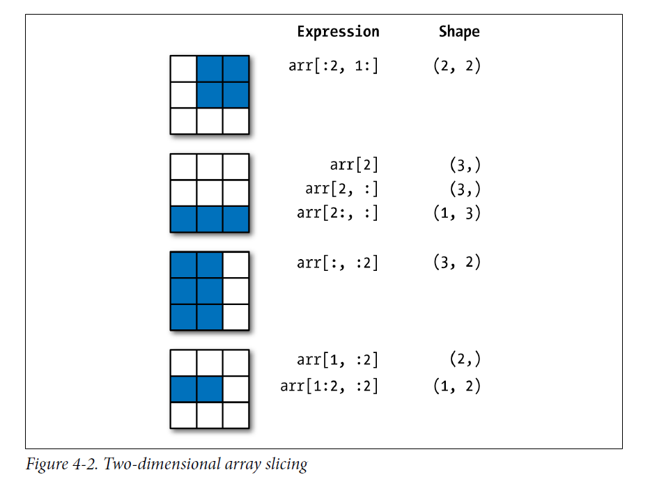

```{r setup, include=FALSE}
library(reticulate)
```

# 安装

在终端中输入:

```
pip install numpy
```
调用numpy

```{python}
import numpy as np
np.__version__
```

# Numpy中的数据格式

Data type | Description
----------|------------
bool_ Boolean | (True or False) stored as a byte
int_ Default | integer type (same as C long; normally either int64 or int32)
intc | Identical to C int (normally int32 or int64)
intp | Integer used for indexing (same as C ssize_t; normally either int32 or int64)
int8 | Byte (–128 to 127)
int16 | Integer (–32768 to 32767)
int32 | Integer (–2147483648 to 2147483647)
int64 | Integer (–9223372036854775808 to 9223372036854775807)
uint8 | Unsigned integer (0 to 255)
uint16 |  Unsigned integer (0 to 65535)
uint32 | Unsigned integer (0 to 4294967295)
uint64 | Unsigned integer (0 to 18446744073709551615)
float_ | Shorthand for float64
float16 | Half-precision float: sign bit, 5 bits exponent, 10 bits mantissa
float32 | Single-precision float: sign bit, 8 bits exponent, 23 bits mantissa
float64 | Double-precision float: sign bit, 11 bits exponent, 52 bits mantissa
complex_ | Shorthand for complex128
complex64 | Complex number, represented by two 32-bit floats
complex128 | Complex number, represented by two 64-bit floats


# Numpy array基础

## Array的属性

先生成三个不同的array,一维,二维和三维array.

```{python}
import numpy as np
np.random.seed(0)#设置seed,保证重复性

x1 = np.random.randint(10, size = 6)#一维
x2 = np.random.randint(10, size = (3, 4))#二维
x3 = np.random.randint(10, size = (3, 4, 5))#三维
x1
x2
x3
```
每一个array都有`ndim`,`shape`和`size`属性.

```{python}
print(x1.ndim, x1.shape, x1.size)
print(x2.ndim, x2.shape, x2.size)
print(x3.ndim, x3.shape, x3.size)
```

从上面例子可以看出来这三个属性分别代表什么意思.

* `ndim`属性:该数据是几维数据.

* `shape`属性:该数据每个维度的大小,这个可以看作是R中的`dim()`函数得到的内容.

* `size`属性:该数据的总的cell数目.

`dtype`属性是指array的数据类型.

```{python}
print(x1.dtype, x2.dtype, x3.dtype)
```

## Array索引:获得其中单个元素

array的索引跟python中内置的列表非常像,可以使用位置索引,但是同样注意从0开始算起.

```{python}
x1
x1[0]
x1[-1]#倒数第一个元素
```

对于多维,比如二维array,则跟R中的数据框类似,使用逗号分开行和列的索引.

```{python}
x2
x2[0,0]
x2[0,0] = 10
x2
x2[0,0]
```

## Array切片:获得一个subarray

类似于列表,可以这样切片:

```
list[start:end:step]
```

需要强调一次再,取出的subarray不包括end.

### 一维array

```{python}
x = np.arange(10)
x
x[:5]#前五个元素
x[4:7]#前五个元素
x[::2]#前五个元素
x[::-1]#将array反向排列
```


### 多维array

多维数组跟一致数组一样,只是需要使用逗号把不同维度的切片分开即可.

```
array[start:end:step,start:end;step]
```

```{python}
x2
x2[1:3, 1:3]
x2[::-1, ::-1]
```

如果对于行或者列只取出一个,会出现什么情况呢?

```{python}
x2
x2[1:3, 0]
x2[1:3, 0].ndim
```

可以看到,降维了.




## 重塑array的形状

array的形状,上面简单介绍了,指的就是数组的各个维度的大小.比较常用的是`reshape`方法.

```{python}
grid = np.arange(1, 10)
grid
grid.reshape((3,3))
```

## Array的合并和分裂(Concatenation and Splitting)

### 合并array

将两个array合并为一个array,可以使用函数`concatenate`,是`numpy`中的函数.

```{python}
x = np.array([1, 2, 3])
y = np.array([3, 2, 1])
z = [99, 99, 99]
np.concatenate([x, y, z])
```

可以看到,需要将array放在一个`list`(中括号)中.

还可以用于二维array的合并.

```{python}
grid = np.array([[1, 2, 3],
[4, 5, 6]])
grid

np.concatenate([grid, grid])
```

可以看到,这样类似于R中的数据库的`rbind`功能,将array按照列进行合并.

那么如何实现`cbind`效果呢?

```{python}
np.concatenate([grid, grid], axis=1)
```

其实还可以使用更为形象的函数,`np.vstack`(相当于R中的`rbind`),和`np.hstack`(相当于R中的`cbind`).

```{python}
x = np.array([1, 2, 3])
grid = np.array([[9, 8, 7],
[6, 5, 4]])
np.vstack([x, grid])
y = np.array([[99],
[99]])
np.hstack([grid, y])
```

### 分割array

分割array有几个函数.

`np.split`,`np.hsplit`,和`np.vsplit`.看几个例子就明白了.

```{python}
x = [1, 2, 3, 99, 99, 3, 2, 1]
x
x1, x2, x3 = np.split(x, [3, 5])
x1
x2
x3
```

对于函数`split`,第一参数是要分割的列表,第二个参数需要是一个list,代表从哪分割,比如这里面的`[3,5]`,就代表着将列表分割为三段,分别是[:3],[3:5],[5:].

同样对于`hsplit`和`vsplit`也就比较好理解了,分别是对多维array进行垂直和水平切割.

```{python}
grid = np.arange(16).reshape((4, 4))
grid
upper, lower = np.vsplit(grid, [2])
print(upper)
print(lower)
left, right = np.hsplit(grid, [2])
print(left)
print(right)
```


# 在Numpy array上进行运算

对array进行运算有一点非常重要,就是进行向量化操作(vectorized operations),跟R一样.这样的好处时可以提高运算速度.

## Universal Functions(UFuncs)

举一个简单的例子,给定一组数,计算每个数的倒数.如果用以前的思维,那么应该对每一个数分别计算倒数,然后循环.但是其实大可不必.

```{python}
import numpy as np
values = np.arange(1,10)
values
1/values
```

这在R中的基础数据格式,向量中就可以运行的,但是对python的基础数据格式,列表和tuple是不可以的.

```{python}
list(range(1,10))
# 1/list(range(1,10))
```

也就是说列表是不支持向量化操作的,只有在numpy的array上才可以.

所以,可以将numpy中的一维array想象成是R中的向量,这样就好记住多了.

那么,同样的,两个一维array也可以像R向量一样,做向量化的操作.比如+,÷等.但是两个array的长度必须相等,否则报错.

```{python}
np.arange(1,10)/np.arange(2,11)
np.arange(1,10) + np.arange(2,11)
np.arange(1,10) - np.arange(2,11)
```

当然,向量化的操作并不局限于一维的array,对于二维的array同样适用,只要将其对比为R中的数据框即可.当然,也可以二维和一维操作,这时候是按照每行都对同一个一维array分别操作进行的.

```{python}
test = np.arange(1,10)
test = test.reshape((3,3))
test2 = np.arange(2,11).reshape((3,3)) 
test3 = np.array([1,2,3])
test
test2
test3
test + test2
test/test2
test/test3
```

再来看一个例子:

```{python}
import numpy as np
x = np.random.randn(8)
y = np.random.randn(8)
x
y
np.maximum(x, y)
```

可以看到,`np.maximum()`函数对两个array的同一位置上的数取最大值,返回与输入array长度相同的array.

如果两个array长度不同,则报错.

常见的接受一个array的ufuncs:

Function|Description
--------|----------
`abs`,`fabs`| Compute the absolute value element-wise for integer, floating-point, or complex values
`sqrt` | Compute the square root of each element (equivalent to arr ** 0.5)
`square` | Compute the square of each element (equivalent to arr ** 2)
`exp` |Compute the exponent ex of each element
`log, log10, log2, log1p` | Natural logarithm (base e), log base 10, log base 2, and log(1 + x), respectively
`sign` | Compute the sign of each element: 1 (positive), 0 (zero), or –1 (negative)
`ceil` | Compute the ceiling of each element (i.e., the smallest integer greater than or equal to that
number)
`floor` | Compute the floor of each element (i.e., the largest integer less than or equal to each element)
`rint` | Round elements to the nearest integer, preserving the dtype
`modf` | Return fractional and integral parts of array as a separate array
`isnan` | Return boolean array indicating whether each value is NaN (Not a Number)
`isfinite, isinf` | Return boolean array indicating whether each element is finite (non-inf, non-NaN) or infinite,
respectively
`cos`, `cosh`,`sin`,`sinh`,`tan`,`tanh` | Regular and hyperbolic trigonometric functions
`arccos`, `arccosh`, `arcsin`, `arcsinh`, `arctan`, `arctanh` |  Inverse trigonometric functions logical_not Compute truth value of not x element-wise (equivalent to ~arr).

常见的接受两个array的ufuncs:

Function|Description
--------|----------
`add` | Add corresponding elements in arrays
`subtract` | Subtract elements in second array from first array
`multiply` | Multiply array elements
`divide`, `floor_divide` | Divide or floor divide (truncating the remainder)
`power` | Raise elements in first array to powers indicated in second array
`maximum`, `fmax` | Element-wise maximum; fmax ignores NaN
`minimum`, `fmin` | Element-wise minimum; fmin ignores NaN
`mod` | Element-wise modulus (remainder of division)
`copysign` Copy sign of values in second argument to values in first argument
`greater`, `greater_equal`, `less`, `less_equal`, `equal`, `not_equal` |  Perform element-wise comparison, yielding boolean array (equivalent to infix operators >, >=, <, <=, ==, !=) 
`logical_and`, `logical_or`, `logical_xor` | Compute element-wise truth value of logical operation (equivalent to infix operators & |, ^)

##  面向数组的编程

一般来说,使用向量化操作,会比loop循环至少快上一个数量级.

### Expressing Conditional Logic as Array Operations

```{python}
import numpy as np
xarr = np.array([1.1, 1.2, 1.3, 1.4, 1.5])
yarr = np.array([2.1, 2.2, 2.3, 2.4, 2.5])
cond = np.array([True, False, True, True, False])
result = [(x if c else y) for x, y, c in zip(xarr, yarr, cond)]
result
```


这种办法问题很多.我们可以使用`np.where()`函数来做.

```{python}
result = np.where(cond, xarr, yarr)
result
```

```{python}
arr = np.random.randn(4, 4)
arr
arr > 0
np.where(arr > 2, 2, -2)
np.where(arr > 0, 2, arr)
```

`np.random.randn()`函数用来随机产生二维的array.

### Numpy中的数学和统计方法

随机产生正态分布数据.

```{python}
arr = np.random.randn(5, 4)
arr
arr.mean()
np.mean(arr)
arr.max()
np.max(arr)
arr.min()
np.min(arr)
arr.sum()
np.sum(arr)
```

对于这些方法,都有一个参数,`axis`,用来指示是否按行或者按列进行计算.0代表按行,1代表按列.

```{python}
arr.mean(axis=0)
arr.mean(axis=1)
```

```{python}
arr = np.array([0, 1, 2, 3, 4, 5, 6, 7])
arr
arr.cumsum()#累乘
arr = np.array([[0, 1, 2], [3, 4, 5], [6, 7, 8]])
arr
arr.cumsum(axis=0)
arr.cumsum(axis=1)
```

array常用统计方法总结

Method | meaning
-------|--------
`sum` | Sum of all the elements in the array or along an axis; zero-length arrays have sum 0
`mean` | Arithmetic mean; zero-length arrays have NaN mean
`std`, `var` | Standard deviation and variance, respectively, with optional degrees of freedom adjustment (default
denominator n)
`min`, `max` | Minimum and maximum
`argmin`, `argmax` | Indices of minimum and maximum elements, respectively
`cumsum` | Cumulative sum of elements starting from 0
`cumprod` | Cumulative product of elements starting from 1

### 排序(sorting)

使用`sort`方法来对array进行排序.

```{python}
arr = np.random.randn(6)
arr
arr.sort()
arr
arr = np.random.randn(5, 3)
arr
arr.sort(axis=0)
arr.sort(axis=1)
```

### Unique and Other Set Logic

```{python}
names = np.array(['Bob', 'Joe', 'Will', 'Bob', 'Will', 'Joe', 'Joe'])
names
np.unique(names)
sorted(names)
sorted(set(names))
```

总结

Functions | meaning
----------|--------
`unique(x)` | Compute the sorted, unique elements in x
`intersect1d(x, y)` | Compute the sorted, common elements in x and y
`union1d(x, y)` | Compute the sorted union of elements
`in1d(x, y)` | Compute a boolean array indicating whether each element of x is contained in y
`setdiff1d(x, y)` | Set difference, elements in x that are not in y
`setxor1d(x, y)` | Set symmetric differences; elements that are in either of the arrays, but not both

### array数据的输入和的输出

跟R的`save`和`load`比较像.

```{python}
arr = np.arange(10)
arr
np.save(file='some_array', arr=arr)
```

默认的后缀民为`.npy`.然后可以使用`np.load()`函数load.

```{python}
np.load('some_array.npy')
```


