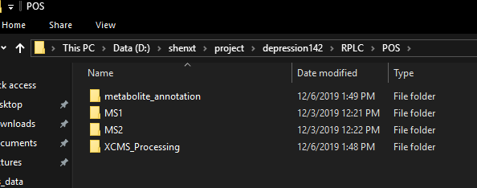
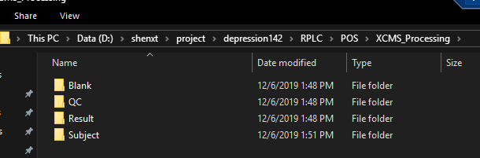
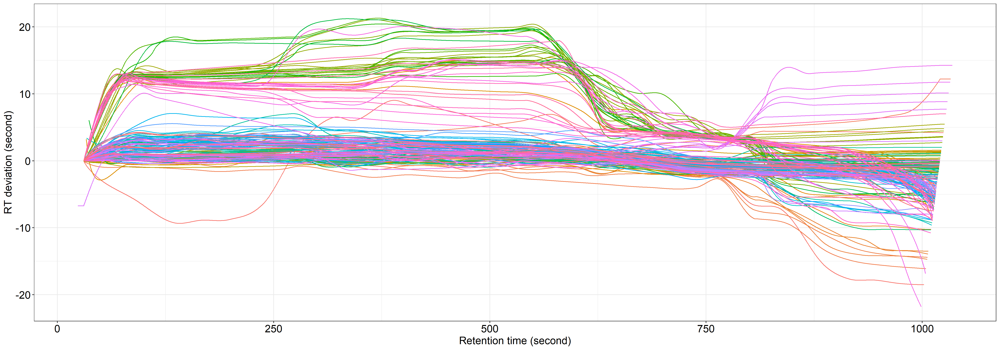
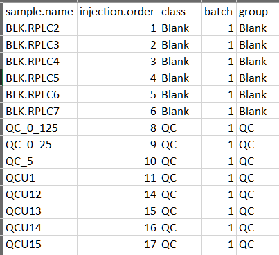

# Instalation

```{r, echo=TRUE, eval=FALSE}
if(!require(devtools)){
  install.packages("devtools")
}

if(!require(tidyverse)){
  install.packages("tidyverse")
}
devtools::install_github("jaspershen/metflow2")
devtools::install_github("jaspershen/metID")
devtools::install_github("jaspershen/tinyTools")
devtools::install_github("jaspershen/sxtTools")

library(metflow2)
library(metID)
library(tidyverse)
```

Use `Chicago` data as a example.

This data is in workstation. The work directory is in `D:/shenxt/project/depression142`. And the data organization is like this:




# Raw data processing

All the mzXML data should be placed in a folder names as `XCMS_processing`. Like this figure shows:



```{r, echo=TRUE, eval=FALSE}
setwd("D:/shenxt/project/depression142/RPLC/POS/XCMS_Processing")
metflow2::processData(polarity = 'positive',
                      peakwidth = c(5, 30), 
                      threads = 10, 
                      min.fraction = 0.8, 
                      fill.peaks = FALSE,
                      output.tic = TRUE, 
                      output.bpc = TRUE,
                      output.rt.correction.plot = TRUE)
```

**Note**:

* polarity: `positive` or `negative`.

* peakwidth: for RPLC, set it as `c(5, 30)`, for HILIC, set it as `c(10, 60)`.

All the results will be outputed in a folder named as `Result`.


`Peak.table.csv` is the Peak.table from XCMS.

`RT correction plot`




# Data cleaning

First, please copy the `Peak.table.csv` from XCMS to another folder, I recommed data cleaning in your own PC or Mac.

And you also need a `sample_info.csv` to provide the information of each sample..





## Positive mode

```{r, eval=FALSE, echo=TRUE}
setwd("xxx/data_cleaning/RPLC/POS")
peak_table <- readr::read_csv("Peak.table.csv")

peak_table <- 
  peak_table %>% 
  rename(name = sample.name,
         mz = mzmed,
         rt = rtmed) %>% 
  select(-c(peak.name, mzmin, mzmax, rtmin, rtmax, npeaks, Blank, QC, Subject, QC_DL))

readr::write_csv(peak_table, "peak_table.csv")

####creat object
(
  rplc_pos_1 <-
    creatMetflowObject(
      ms1.data = "peak_table.csv",
      sample.information = "sample_info.csv",
      path = "."
    )
)

save(rplc_pos_1, file = "rplc_pos_1")

###remove peaks
(
  rplc_pos_2 <-
    filterPeak(
      object = rplc_pos_1,
      min.fraction.qc = 0.8,##QC at least more than 80%
      min.fraction = 0.2,##Subject no restraction
      min.subject.qc.ratio = 0,##don't use blank to remove any peaks
      dl.qc.r2.cutoff = 0
    )
)


save(rplc_pos_2, file = "rplc_pos_2")

###remove some samples (outliers)
(
  rplc_pos_3 <-
    filterSample(object = rplc_pos_2,
                 min.fraction.peak = 0.5)
)

save(rplc_pos_3, file = "rplc_pos_3")


#get the MV distribution plot
(
  plot <- 
    getMVplot4sample(object = rplc_pos_3)
)


#MV imputateion

(
  rplc_pos_4 <- 
    imputeMV(object = rplc_pos_3, method = 'knn')
)

save(rplc_pos_4, file = "rplc_pos_4")

###RSD distribution
qc_rsd <- calRSD(object = rplc_pos_4, slot = "QC")

(plot1 <- 
    ggplot(data = qc_rsd, aes(index, rsd)) +
    geom_hline(yintercept = 30, linetype = 2, colour = "red") +
    geom_point() +
    scale_y_continuous(name = "Relative standard deviation (RSD, %)", limits = c(0,100),
                       breaks = c(0, 25, 30, 50, 75, 100), labels = c(c(0, 25, 30, 50, 75, 100)))+
    labs(x = "Peak index") +
    theme_bw() +
    theme(axis.title = element_text(size = 15),
          axis.text = element_text(size = 12),
          legend.title = element_text(size = 15),
          legend.text = element_text(size = 12),
          strip.background = element_rect(fill = "#0099B47F"),
          strip.text = element_text(color = "white", size = 15))
)


(plot2 <- 
    ggplot(data = qc_rsd, aes(x = rsd)) +
    geom_histogram(binwidth = 10, colour = "white", fill = "#0099B47F", origin = 0) +
    scale_x_continuous(name = "Relative standard deviation (RSD, %)") +
    labs(y = "Peak number") +
    # geom_vline(xintercept = 30, linetype = 2, colour = "red") +
    annotate(geom = "rect", xmin = 0, xmax = 30, ymin = 0, ymax = 380,
             alpha = 0.1, fill = "#ED00007F") +
    theme_bw()+
    theme(axis.title = element_text(size = 15),
          axis.text = element_text(size = 12),
          legend.title = element_text(size = 15),
          legend.text = element_text(size = 12),
          strip.background = element_rect(fill = "#0099B47F"),
          strip.text = element_text(color = "white", size = 15))
)


## data normalization
(
  rplc_pos_5 <- 
    normalizeData(object = rplc_pos_4, 
                  method = "mean")
)

save(rplc_pos_5, file = "rplc_pos_5")

###batch intergration

(
  rplc_pos_6 <- 
    metflow2:::integrateData(
      object = rplc_pos_5, 
      method = "subject.mean")
)

save(rplc_pos_6, file = "rplc_pos_6")

##output peak table after data cleaning
peak_table_after_cleaning <- rplc_pos_6@ms1.data[[1]]
readr::write_csv(peak_table_after_cleaning, "peak_table_after_cleaning.csv")
```

`peak_table_after_cleaning.csv` is the peak table after data cleaning.

## Negative mode

```{r, eval=FALSE, echo=TRUE}
sxtTools::setwd_project()
####Negative mode
setwd("data_cleaning/RPLC/NEG")
peak_table <- readr::read_csv("Peak.table.csv")


peak_table <- 
  peak_table %>% 
  rename(name = sample.name,
         mz = mzmed,
         rt = rtmed) %>% 
  select(-c(peak.name, mzmin, mzmax, rtmin, rtmax, npeaks, Blank, QC, Subject, QC_DL))


readr::write_csv(peak_table, "peak_table.csv")

####creat object

(
  rplc_neg_1 <-
    creatMetflowObject(
      ms1.data = "peak_table.csv",
      sample.information = "sample_info.csv",
      path = "."
    )
)

save(rplc_neg_1, file = "rplc_neg_1")

###remove peaks
(
  rplc_neg_2 <-
    filterPeak(
      object = rplc_neg_1,
      min.fraction.qc = 0.8,##QC at least more than 80%
      min.fraction = 0.2,##Subject no restraction
      min.subject.qc.ratio = 0,##don't use blank to remove any peaks
      dl.qc.r2.cutoff = 0
    )
)


save(rplc_neg_2, file = "rplc_neg_2")

###remove some samples (outliers)
(
  rplc_neg_3 <-
    filterSample(object = rplc_neg_2,
                 min.fraction.peak = 0.5)
)

save(rplc_neg_3, file = "rplc_neg_3")


#get the MV distribution plot
(
  plot <- 
    getMVplot4sample(object = rplc_neg_3)
)


#MV imputateion

(
  rplc_neg_4 <- 
    imputeMV(object = rplc_neg_3, method = 'knn')
)

save(rplc_neg_4, file = "rplc_neg_4")

###RSD distribution
qc_rsd <- calRSD(object = rplc_neg_4, slot = "QC")

(plot1 <- 
    ggplot(data = qc_rsd, aes(index, rsd)) +
    geom_hline(yintercept = 30, linetype = 2, colour = "red") +
    geom_point() +
    scale_y_continuous(name = "Relative standard deviation (RSD, %)", limits = c(0,100),
                       breaks = c(0, 25, 30, 50, 75, 100), labels = c(c(0, 25, 30, 50, 75, 100)))+
    labs(x = "Peak index") +
    theme_bw() +
    theme(axis.title = element_text(size = 15),
          axis.text = element_text(size = 12),
          legend.title = element_text(size = 15),
          legend.text = element_text(size = 12),
          strip.background = element_rect(fill = "#0099B47F"),
          strip.text = element_text(color = "white", size = 15))
)


(plot2 <- 
    ggplot(data = qc_rsd, aes(x = rsd)) +
    geom_histogram(binwidth = 10, colour = "white", fill = "#0099B47F", origin = 0) +
    scale_x_continuous(name = "Relative standard deviation (RSD, %)") +
    labs(y = "Peak number") +
    # geom_vline(xintercept = 30, linetype = 2, colour = "red") +
    annotate(geom = "rect", xmin = 0, xmax = 30, ymin = 0, ymax = 380,
             alpha = 0.1, fill = "#ED00007F") +
    theme_bw()+
    theme(axis.title = element_text(size = 15),
          axis.text = element_text(size = 12),
          legend.title = element_text(size = 15),
          legend.text = element_text(size = 12),
          strip.background = element_rect(fill = "#0099B47F"),
          strip.text = element_text(color = "white", size = 15))
)


## data normalization
(
  rplc_neg_5 <- 
    normalizeData(object = rplc_neg_4, 
                  method = "mean")
)

save(rplc_neg_5, file = "rplc_neg_5")

###batch intergration

(
  rplc_neg_6 <- 
    metflow2:::integrateData(
      object = rplc_neg_5, 
      method = "subject.mean")
)

save(rplc_neg_6, file = "rplc_neg_6")

##output peak table after data cleaning
peak_table_after_cleaning <- rplc_neg_6@ms1.data[[1]]
readr::write_csv(peak_table_after_cleaning, "peak_table_after_cleaning.csv")
```


# Metabolite identification

Please copy the peak table after data cleaning to the folder in workstaiton:

`D:\shenxt\project\smartD\RPLC\POS\metabolite_annotation\NCE25` and `D:\shenxt\project\smartD\RPLC\POS\metabolite_annotation\NCE50`.

And then copy all the MS2 library to `D:\shenxt\project\smartD\RPLC\POS\metabolite_annotation\NCE25` and `D:\shenxt\project\smartD\RPLC\POS\metabolite_annotation\NCE50`. The MS2 library can be found here:

`D:\shenxt\project\database\metabolite`.


```{r,eval=FALSE, echo=TRUE}
#####RPLC positive
setwd("D:/shenxt/project/smartD/RPLC/POS/metabolite_annotation/NCE25")
library(metID)
parameter1 <- metIdentifyParam(ms1.ms2.match.mz.tol = 25, 
                               ms1.ms2.match.rt.tol = 60, 
                               ms1.match.ppm = 25, 
                               ms2.match.tol = 0.4, 
                               rt.match.tol = 90,
                               polarity = "positive", 
                               ce = "all", 
                               column = "rp", 
                               total.score.tol = 0, 
                               candidate.num = 3,
                               database = "msDatabase_rplc0.0.1", 
                               threads = 4)

parameter2 <- metIdentifyParam(ms1.ms2.match.mz.tol = 25,
                               ms1.ms2.match.rt.tol = 60, 
                               ms1.match.ppm = 25, 
                               ms2.match.tol = 0.4, 
                               rt.match.tol = 90,
                               polarity = "positive", 
                               ce = "all", 
                               column = "rp", 
                               total.score.tol = 0, 
                               candidate.num = 3,
                               database = "hmdbDatabase0.0.1", 
                               threads = 4)

parameter3 <- metIdentifyParam(ms1.ms2.match.mz.tol = 25, 
                               ms1.ms2.match.rt.tol = 60, 
                               ms1.match.ppm = 25, 
                               ms2.match.tol = 0.4, 
                               rt.match.tol = 90,
                               polarity = "positive", 
                               ce = "all", 
                               column = "rp", 
                               total.score.tol = 0, 
                               candidate.num = 3,
                               database = "massbankDatabase0.0.1", 
                               threads = 4)

parameter4 <- metIdentifyParam(ms1.ms2.match.mz.tol = 25, 
                               ms1.ms2.match.rt.tol = 60, 
                               ms1.match.ppm = 25, 
                               ms2.match.tol = 0.4, 
                               rt.match.tol = 90,
                               polarity = "positive", 
                               ce = "all", 
                               column = "rp", 
                               total.score.tol = 0, 
                               candidate.num = 3,
                               database = "metlinDatabase0.0.1", 
                               threads = 4)

parameter5 <- metIdentifyParam(ms1.ms2.match.mz.tol = 25, 
                               ms1.ms2.match.rt.tol = 60, 
                               ms1.match.ppm = 25, 
                               ms2.match.tol = 0.4, 
                               rt.match.tol = 90,
                               polarity = "positive", 
                               ce = "all", 
                               column = "rp", 
                               total.score.tol = 0, 
                               candidate.num = 3,
                               database = "monaDatabase0.0.1", 
                               threads = 4)

parameter6 <- metIdentifyParam(ms1.ms2.match.mz.tol = 25, 
                               ms1.ms2.match.rt.tol = 60, 
                               ms1.match.ppm = 25, 
                               ms2.match.tol = 0.4, 
                               rt.match.tol = 90,
                               polarity = "positive", 
                               ce = "all", 
                               column = "rp", 
                               total.score.tol = 0, 
                               candidate.num = 3,
                               database = "nistDatabase0.0.1", 
                               threads = 4)

parameter7 <- metIdentifyParam(ms1.ms2.match.mz.tol = 25, 
                               ms1.ms2.match.rt.tol = 60, 
                               ms1.match.ppm = 25, 
                               ms2.match.tol = 0.4, 
                               rt.match.tol = 90,
                               polarity = "positive", 
                               ce = "all", 
                               column = "rp", 
                               total.score.tol = 0, 
                               candidate.num = 3,
                               database = "orbitrapDatabase0.0.1", 
                               threads = 4)

parameter8 <- mzIdentifyParam(ms1.match.ppm = 25, 
                              polarity = "positive", 
                              column = "rp", 
                              candidate.num = 3,
                              database = "HMDB.metabolite.data", 
                              threads = 4)

ms1.data <- grep("\\.csv", dir(), value = TRUE)
ms2.data <- grep("mgf", dir(), value = TRUE)

result.pRPLC.nce25 <- metIdentify4all(
  ms1.data = ms1.data,
  ms2.data = ms2.data,
  parameter.list = c(
    parameter1,
    parameter2,
    parameter3,
    parameter4,
    parameter5,
    parameter6,
    parameter7,
    parameter8
  ),
  path = "."
)

save(result.pRPLC.nce25, file = "result.pRPLC.nce25")

setwd("../NCE50")
ms1.data <- grep("\\.csv", dir(), value = TRUE)
ms2.data <- grep("mgf", dir(), value = TRUE)
result.pRPLC.nce50 <- metIdentify4all(ms1.data = ms1.data,
                                      ms2.data = ms2.data, 
                                      parameter.list = c(parameter1,
                                                         parameter2,
                                                         parameter3,
                                                         parameter4,
                                                         parameter5,
                                                         parameter6,
                                                         parameter7),
                                      path = ".")

save(result.pRPLC.nce50, file = "result.pRPLC.nce50")

#####RPLC negative
setwd("D:/shenxt/project/smartD/RPLC/NEG/metabolite_annotation/NCE25")
parameter1 <- metIdentifyParam(ms1.ms2.match.mz.tol = 25, 
                               ms1.ms2.match.rt.tol = 60, 
                               ms1.match.ppm = 25, 
                               ms2.match.tol = 0.4, 
                               rt.match.tol = 90,
                               polarity = "negative", 
                               ce = "all", 
                               column = "rp", 
                               total.score.tol = 0, 
                               candidate.num = 3,
                               database = "msDatabase_rplc0.0.1", 
                               threads = 4)

parameter2 <- metIdentifyParam(ms1.ms2.match.mz.tol = 25,
                               ms1.ms2.match.rt.tol = 60, 
                               ms1.match.ppm = 25, 
                               ms2.match.tol = 0.4, 
                               rt.match.tol = 90,
                               polarity = "negative", 
                               ce = "all", 
                               column = "rp", 
                               total.score.tol = 0, 
                               candidate.num = 3,
                               database = "hmdbDatabase0.0.1", 
                               threads = 4)

parameter3 <- metIdentifyParam(ms1.ms2.match.mz.tol = 25, 
                               ms1.ms2.match.rt.tol = 60, 
                               ms1.match.ppm = 25, 
                               ms2.match.tol = 0.4, 
                               rt.match.tol = 90,
                               polarity = "negative", 
                               ce = "all", 
                               column = "rp", 
                               total.score.tol = 0, 
                               candidate.num = 3,
                               database = "massbankDatabase0.0.1", 
                               threads = 4)

parameter4 <- metIdentifyParam(ms1.ms2.match.mz.tol = 25, 
                               ms1.ms2.match.rt.tol = 60, 
                               ms1.match.ppm = 25, 
                               ms2.match.tol = 0.4, 
                               rt.match.tol = 90,
                               polarity = "negative", 
                               ce = "all", 
                               column = "rp", 
                               total.score.tol = 0, 
                               candidate.num = 3,
                               database = "metlinDatabase0.0.1", 
                               threads = 4)

parameter5 <- metIdentifyParam(ms1.ms2.match.mz.tol = 25, 
                               ms1.ms2.match.rt.tol = 60, 
                               ms1.match.ppm = 25, 
                               ms2.match.tol = 0.4, 
                               rt.match.tol = 90,
                               polarity = "negative", 
                               ce = "all", 
                               column = "rp", 
                               total.score.tol = 0, 
                               candidate.num = 3,
                               database = "monaDatabase0.0.1", 
                               threads = 4)

parameter6 <- metIdentifyParam(ms1.ms2.match.mz.tol = 25, 
                               ms1.ms2.match.rt.tol = 60, 
                               ms1.match.ppm = 25, 
                               ms2.match.tol = 0.4, 
                               rt.match.tol = 90,
                               polarity = "negative", 
                               ce = "all", 
                               column = "rp", 
                               total.score.tol = 0, 
                               candidate.num = 3,
                               database = "nistDatabase0.0.1", 
                               threads = 4)

parameter7 <- metIdentifyParam(ms1.ms2.match.mz.tol = 25, 
                               ms1.ms2.match.rt.tol = 60, 
                               ms1.match.ppm = 25, 
                               ms2.match.tol = 0.4, 
                               rt.match.tol = 90,
                               polarity = "negative", 
                               ce = "all", 
                               column = "rp", 
                               total.score.tol = 0, 
                               candidate.num = 3,
                               database = "orbitrapDatabase0.0.1", 
                               threads = 4)

parameter8 <- mzIdentifyParam(ms1.match.ppm = 25, 
                              polarity = "negative", 
                              column = "rp", 
                              candidate.num = 3,
                              database = "HMDB.metabolite.data", 
                              threads = 4)


ms1.data <- grep("\\.csv", dir(), value = TRUE)
ms2.data <- grep("mgf", dir(), value = TRUE)
result.nRPLC.nce25 <- metIdentify4all(ms1.data = ms1.data,
                                      ms2.data = ms2.data, 
                                      parameter.list = c(parameter1,
                                                         parameter2,
                                                         parameter3,
                                                         parameter4,
                                                         parameter5,
                                                         parameter6,
                                                         parameter7,
                                                         parameter8),
                                      path = ".")

save(result.nRPLC.nce25, 
     file = "result.nRPLC.nce25")

setwd("../NCE50")

ms1.data <- grep("\\.csv", dir(), value = TRUE)
ms2.data <- grep("mgf", dir(), value = TRUE)
result.nRPLC.nce50 <- metIdentify4all(ms1.data = ms1.data,
                                      ms2.data = ms2.data, 
                                      parameter.list = c(parameter1,
                                                         parameter2,
                                                         parameter3,
                                                         parameter4,
                                                         parameter5,
                                                         parameter6,
                                                         parameter7),
                                      path = ".")

save(result.nRPLC.nce50, file = "result.nRPLC.nce50")

###get annotation table
####RPLC positive
setwd("D:/shenxt/project/smartD/RPLC/POS/metabolite_annotation")
load("NCE25/result.pRPLC.nce25")
load("NCE50/result.pRPLC.nce50")

identification.table1 <- getIdentificationTable(result.pRPLC.nce25[[1]],
                                                result.pRPLC.nce50[[1]],
                                                candidate.num = 1,
                                                type = "old")
identification.table1 <-
  identification.table1 %>%
  filter(!is.na(Identification)) %>%
  mutate(Level = 1)


identification.table2 <-
  getIdentificationTable(
    result.pRPLC.nce25[[2]],
    result.pRPLC.nce25[[3]],
    result.pRPLC.nce25[[4]],
    result.pRPLC.nce25[[5]],
    result.pRPLC.nce25[[6]],
    result.pRPLC.nce25[[7]],
    result.pRPLC.nce50[[2]],
    result.pRPLC.nce50[[3]],
    result.pRPLC.nce50[[4]],
    result.pRPLC.nce50[[5]],
    result.pRPLC.nce50[[6]],
    result.pRPLC.nce50[[7]],
    candidate.num = 1,
    type = "old"
  )

identification.table2 <-
  identification.table2 %>% 
  filter(!is.na(Identification), !is.element(name, identification.table1$name)) %>% 
  mutate(Level = 2)

identification.table3 <- 
  getIdentificationTable2(result.pRPLC.nce25[[8]],
                          candidate.num = 3,
                          type = "old")

identification.table3 <-
  identification.table3 %>% 
  filter(!is.na(Identification), !is.element(name, identification.table1$name), !is.element(name, identification.table2$name)) %>% 
  mutate(Level = 3)

identification.table <- 
  dplyr::full_join(rbind(identification.table1, identification.table2), 
                   identification.table3, 
                   by = colnames(identification.table3))

write.csv(identification.table, "identification.table.csv", row.names = FALSE)


identification.table.new <- trans2newStyle(identification.table = identification.table)
write.csv(identification.table.new, "identification.table.new.csv", row.names = FALSE)


####RPLC negative
setwd("D:/shenxt/project/smartD/RPLC/NEG/metabolite_annotation")
load("NCE25/result.nRPLC.nce25")
load("NCE50/result.nRPLC.nce50")

identification.table1 <- getIdentificationTable(result.nRPLC.nce25[[1]],
                                                result.nRPLC.nce50[[1]],
                                                candidate.num = 1,
                                                type = "old")

identification.table1 <- 
  identification.table1 %>% 
  filter(!is.na(Identification)) %>% 
  mutate(Level = 1)

identification.table2 <-
  getIdentificationTable(
    result.nRPLC.nce25[[2]],
    result.nRPLC.nce25[[3]],
    result.nRPLC.nce25[[4]],
    result.nRPLC.nce25[[5]],
    result.nRPLC.nce25[[6]],
    result.nRPLC.nce25[[7]],
    result.nRPLC.nce50[[2]],
    result.nRPLC.nce50[[3]],
    result.nRPLC.nce50[[4]],
    result.nRPLC.nce50[[5]],
    result.nRPLC.nce50[[6]],
    result.nRPLC.nce50[[7]],
    candidate.num = 1,
    type = "old"
  )

identification.table2 <-
  identification.table2 %>% 
  filter(!is.na(Identification), !is.element(name, identification.table1$name)) %>% 
  mutate(Level = 2)


identification.table3 <- 
  getIdentificationTable2(result.nRPLC.nce25[[8]],
                          candidate.num = 3,
                          type = "old")


identification.table3 <-
  identification.table3 %>% 
  filter(!is.na(Identification), !is.element(name, identification.table1$name), !is.element(name, identification.table2$name)) %>% 
  mutate(Level = 3)

identification.table <- 
  dplyr::full_join(rbind(identification.table1, identification.table2), 
                   identification.table3, 
                   by = colnames(identification.table3))

write.csv(identification.table, "identification.table.csv", row.names = FALSE)


identification.table.new <- trans2newStyle(identification.table = identification.table)
write.csv(identification.table.new, "identification.table.new.csv", row.names = FALSE)

```


For HILIC data, the identification is same, just change `parameter1` as :

```
parameter1 <- metIdentifyParam(ms1.ms2.match.mz.tol = 25, 
                               ms1.ms2.match.rt.tol = 60, 
                               ms1.match.ppm = 25, 
                               ms2.match.tol = 0.4, 
                               rt.match.tol = 90,
                               polarity = "negative", 
                               ce = "all", 
                               column = "rp", 
                               total.score.tol = 0, 
                               candidate.num = 3,
                               database = "msDatabase_hilic0.0.1", 
                               threads = 4)
```

And change the result name as `result.pHILIC.nce25`,`result.pHILIC.nce50`,`result.nHILIC.nce25` and `result.nHILIC.nce50`.